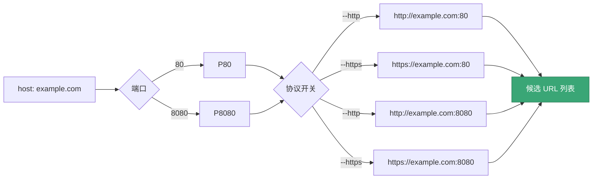
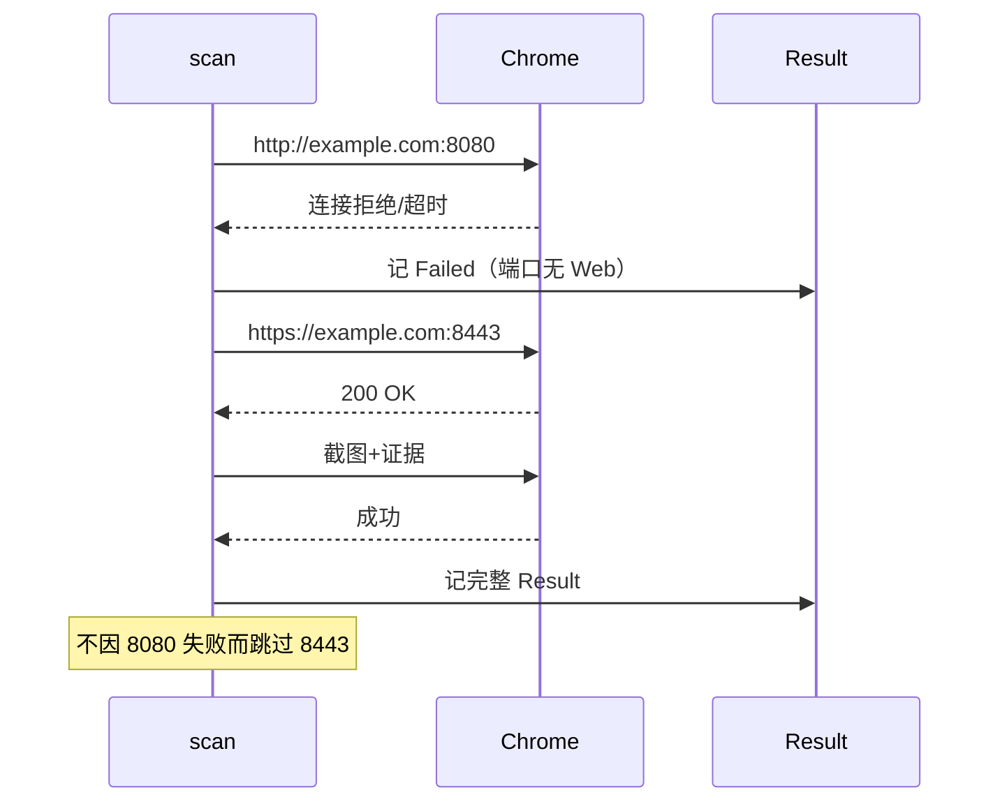

# 端口与协议展开

<p align="center">🔌 用 `--ports` 把裸 host/IP 展开为 Web 候选 URL。</p>

## 标志

| 标志 | 默认 | 说明 |
|------|------|------|
| `--ports` | — | 端口列表（如 `80,443,8080`） |
| `--http` | `true` | 生成 `http://` 候选 |
| `--https` | `true` | 生成 `https://` 候选 |

::: warning 重要
`--ports` 是 **Web 候选 URL 展开**，不是 TCP/UDP 端口扫描。snir 不做端口发现，只对给定端口尝试 Web 截图。
:::

## 展开逻辑

`ExpandTargets` 对裸 host/IP，按协议开关与端口列表做笛卡尔积生成候选 URL：



同一 host 多端口探测，某端口无 Web 服务时的回退时序：



`ExpandTargets` 对裸 host/IP：

1. 取协议（`--http` → `http://`，`--https` → `https://`）
2. 取端口（`--ports`，无则用默认 80/443）
3. 笛卡尔积生成候选 URL

## 示例

```bash
# 默认：80 与 443 的 http/https
snir scan file -f hosts.txt

# 指定端口
snir scan file -f hosts.txt --ports 80,443,8080,8443

# 仅 HTTPS
snir scan file -f hosts.txt --https --http=false

# 仅 HTTP + 自定义端口
snir scan file -f hosts.txt --http --https=false --ports 80,8080,8000
```

## 展开结果示例

`hosts.txt` 含 `example.com`，`--ports 8080 --http --https`：

```
http://example.com:8080
https://example.com:8080
```

## 适用场景

::: tip 笛卡尔积会爆炸，注意总量
`--ports 80,443,8080,8443` × `--http --https` = 每个 host **8 个候选 URL**。1000 个 host 就是 8000 次请求。

- 大批量场景精简端口列表，只留真正关心的
- 配合 `--threads` 与 `--timeout` 控制并发与超时
:::

- 对一批 IP/host 探测常见 Web 端口
- 内网 Web 服务发现（授权前提下）
- 多端口资产盘点

## 默认端口

- `http` → 80
- `https` → 443

`DefaultPortForScheme` 给出此映射。指定 `--ports` 时，每个端口都会生成 http 与 https（取决于开关）候选。

## 下一步

- [scan file](./scan-file)
- [scan cidr](./scan-cidr)
- [端口与协议构建器](../sdk/builder-ports)
