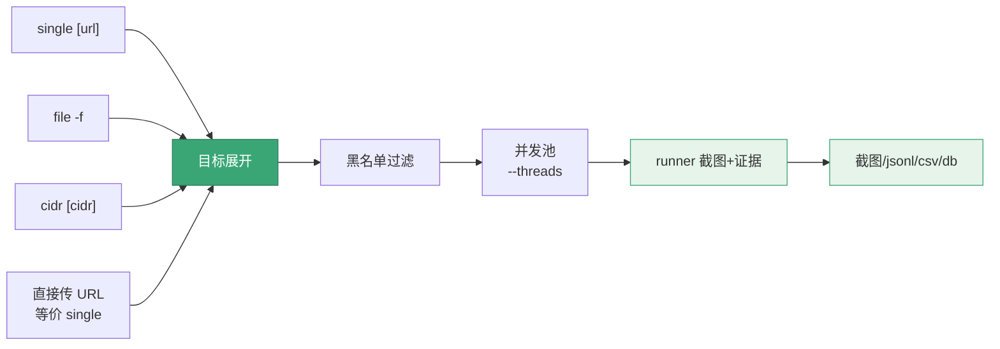

# scan 命令族

<p align="center">📸 snir scan — 扫描并截图网站。</p>

`scan` 是 snir 最核心的命令，负责扫描指定的 URL、文件或网段，并对网站截图与信息收集。

三种输入入口共享同一套扫描流水线：



## 子命令

| 子命令 | 用法 | 说明 |
|--------|------|------|
| `single [url]` | `snir scan single https://example.com` | 扫描单个 URL |
| `file` | `snir scan file -f urls.txt` | 从文件批量扫描 |
| `cidr [cidr]` | `snir scan cidr 192.168.1.0/24` | 扫描网段 |
| （直接 URL） | `snir scan example.com` | 等价于 single |

## 直接传 URL

`scan` 后直接给一个 URL 参数，视为单 URL 扫描：

```bash
snir scan example.com
snir scan https://example.com/path
```

## 设备预设

`--device <name>` 应用设备预设（视口/UA/像素比/触摸）：

```bash
snir scan example.com --device iphone-15
```

`--list-devices` 列出全部预设：

```bash
snir scan --list-devices
```

见 [设备模拟](./scan-device)。

## 公共标志

`scan` 的持久化标志对所有子命令生效，涵盖：截图、证据、Chrome、代理、Cookie、设备、JS、输出、数据库、黑名单、端口。完整表见 [CLI 标志全表](../reference/cli-flags)。

## 示例

```bash
# 基本单页
snir scan example.com

# 增加超时和延迟
snir scan example.com --timeout 60 --delay 3

# 批量
snir scan file -f urls.txt --threads 10 --write-jsonl --db

# 端口展开
snir scan file -f hosts.txt --ports 80,443,8080,8443

# 网段
snir scan cidr 192.168.1.0/24

# 完整证据
snir scan example.com --full-page --save-html --save-headers --save-cookies --save-console --save-network

# 高分辨率
snir scan example.com --resolution-x 1920 --resolution-y 1080

# 移动端
snir scan example.com --device iphone-15

# 代理
snir scan example.com --proxy http://127.0.0.1:8080
```

## 下一步

- [scan single](./scan-single)
- [scan file](./scan-file)
- [scan cidr](./scan-cidr)
- 各选项专题：[截图](./scan-screenshot)、[证据](./scan-evidence)、[Chrome](./scan-chrome)、[代理](./scan-proxy)、[Cookie](./scan-cookie)、[设备](./scan-device)、[JS](./scan-js)、[输出](./scan-output)、[数据库](./scan-db)、[黑名单](./scan-blacklist)、[端口](./scan-ports)
