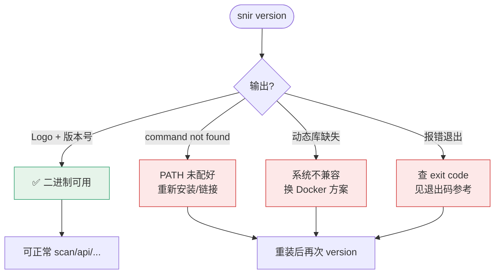

# version 命令

<p align="center">ℹ️ `snir version` — 显示版本信息。</p>

## 用法

```bash
snir version
```

## 输出

打印 Logo（`ascii.Logo()`）与版本信息（`ascii.VersionInfo()`），包含：

- 🏷️ 版本号
- 🔗 项目地址：`https://github.com/cyberspacesec/snir-skills`
- 构建信息（如有）

## 用途

::: tip 装完先 `snir version` 验证
任何安装方式（go install / 二进制 / docker）跑通后，第一件事就是 `snir version`：
- ✅ 能打出 Logo + 版本号 → 二进制可用、Chrome 不依赖也能跑
- ❌ 报 `command not found` → PATH 没配好
- ❌ 报动态库缺失 → 二进制与系统不兼容，换 docker 方案

排查问题时也先报版本号，便于定位是否已修复。
:::

`snir version` 作为安装后的第一道自检，其判定分支如下：



- 安装后验证
- 排查时确认版本
- 脚本中取版本号

## 示例

```bash
$ snir version
   _____ _    _____
  / ___(_)  / ___/___  ___
 / /__  / / / /__/ __ \/ _/
 \___/_/_/  \___/_/ /_/\_/

snir vX.Y.Z
https://github.com/cyberspacesec/snir-skills
```

（实际 Logo 以程序输出为准）

## 下一步

- [CLI 总览](./overview)
- [安装](../guide/installation)
- [更新日志](../reference/changelog)
