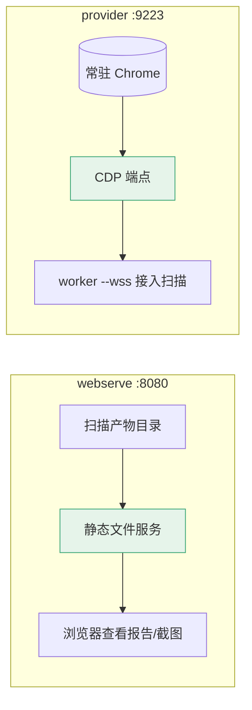

# webserve 命令

<p align="center">🌐 `snir webserve` — 本地 Web 服务器查看结果。</p>

启动一个本地静态 Web 服务器，托管截图、报告等生成产物，便于浏览器查看。

## 用法

```bash
snir webserve [flags]
```

## 标志

| 标志 | 默认 | 说明 |
|------|------|------|
| `--host` | `0.0.0.0` | Web 服务器监听地址 |
| `--port` | `8080` | Web 服务器监听端口 |

（目录参数从 `Options.Report` 或位置参数指定）

## 示例

```bash
# 生成报告并查看
snir scan file -f urls.txt --write-jsonl
snir report html -i results.jsonl -o report.html
snir webserve --dir .

# 浏览器访问 http://localhost:8080
```

## 适用场景

- 本地浏览生成的 HTML 报告
- 查看截图目录
- 临时分享采集结果（仅本地/内网）

## 与 provider 的区别

- `webserve`：托管**静态文件**（报告/截图）
- `provider`：提供 **CDP 浏览器连接**

两者职责对比：



## 下一步

- [report 总览](./report)
- [报告生成](../advanced/reports)
- [内部 pkg/report/server](../internals/report)
