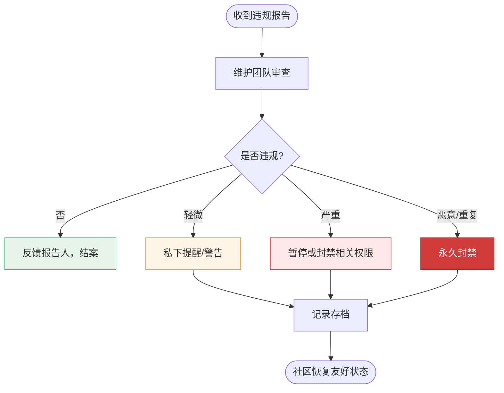

# 行为准则

💜 snir 社区行为准则。

## 我们的承诺

为营造开放友好的环境，贡献者和维护者承诺：参与本项目与社区，不因年龄、性别、性取向、外貌、国籍、宗教或技术经验而歧视任何人。

## 我们的准则

✅ **鼓励**：

- 使用友好包容的语言
- 尊重不同观点与经验
- 接受建设性批评
- 关注社区整体利益

❌ **禁止**：

- 骚扰、侮辱或贬损言论
- 公开他人隐私信息
- 其他不专业行为

## 范围

本准则适用于项目所有社区空间（Issue、PR、讨论、邮件等）。

## 执行

违规行为请通过 [GitHub Issue](https://github.com/cyberspacesec/snir-skills/issues) 私密报告给维护者。维护团队将审查并妥善处理。

违规报告的处理流程：

## 下一步

- [贡献指南](./contributing)
