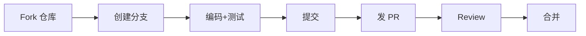

# 贡献指南

<p align="center">🤝 欢迎为 snir 贡献代码、文档与反馈。</p>

## 贡献方式

| 方式 | 说明 |
|------|------|
| 🐛 报告 Bug | 提 [GitHub Issue](https://github.com/cyberspacesec/snir-skills/issues)，附复现命令与日志 |
| 💡 提建议 | Issue 标注 "enhancement" |
| 🔧 提交 PR | Fork → 分支 → 改 → 测试 → PR |
| 📝 改文档 | 文档在 `website/`，基于 VitePress |
| 🌍 翻译 | 欢迎多语言贡献 |

## 开发流程



### 环境

- Go 1.23+
- Node 20+（构建文档站）
- Chrome/Chromium（运行截图）

### 构建

```bash
make build
./snir version
```

### 测试

```bash
go test ./...
```

### 文档

```bash
cd website
npm install
npm run docs:dev
```

见 [文档贡献](./docs)。

## 代码规范

- 遵循 Go 标准格式 `gofmt` / `goimports`
- 新增导出符号须有注释
- 公共 API 变更须更新文档
- 提交信息遵循 [Conventional Commits](https://www.conventionalcommits.org/)（如 `feat:`、`fix:`、`docs:`）

## 提交信息示例

```
feat: add sdk cookie evidence helpers
fix: handle nil pointer in pool stats
docs: expand proxy rotation guide
```

## PR 检查清单

::: details 提 PR 前逐项核对
- [ ] 代码通过 `go build` 与 `go test`
- [ ] 新功能有测试
- [ ] 文档已更新（`website/` 或 `references/`）
- [ ] 提交信息遵循 Conventional Commits（`feat:`/`fix:`/`docs:`）
- [ ] 不引入新的外部依赖（除非必要）
- [ ] `gofmt -w` 已跑（CI 会校验格式）
- [ ] 截图相关改动本地用真实 Chrome 验证过
:::

## 行为准则

参与贡献即代表同意遵守 [行为准则](./code-of-conduct)。

## 下一步

- [文档贡献](./docs)
- [路线图](./roadmap)
- [内部模块](../internals/overview)：了解代码结构
