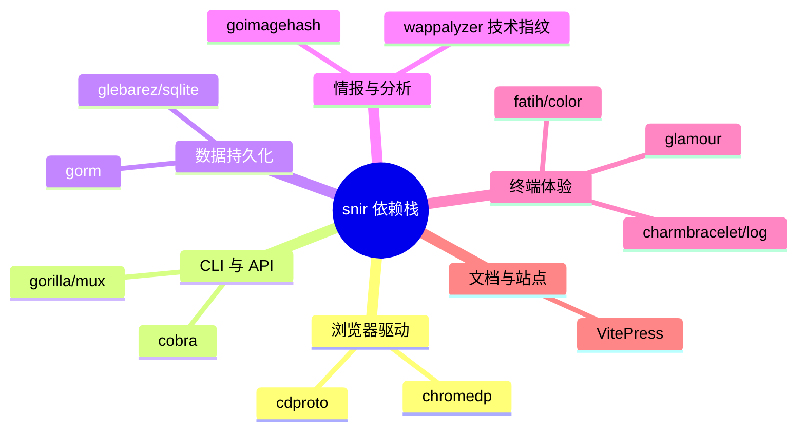

# 致谢

🙏 snir 离不开这些项目与贡献者。

## 核心依赖

snir 的能力建立在以下优秀开源项目之上，按职能归类：

| 项目 | 用途 |
|------|------|
| [chromedp](https://github.com/chromedp/chromedp) / [cdproto](https://github.com/chromedp/cdproto) | Chrome DevTools Protocol 驱动 |
| [cobra](https://github.com/spf13/cobra) | CLI 命令框架 |
| [gorm](https://gorm.io) + [sqlite](https://github.com/glebarez/sqlite) | ORM 与 SQLite |
| [goimagehash](https://github.com/corona10/goimagehash) | 感知哈希 |
| [gorilla/mux](https://github.com/gorilla/mux) | HTTP 路由 |
| [charmbracelet/log](https://github.com/charmbracelet/log) + [glamour](https://github.com/charmbracelet/glamour) | 日志与 Markdown 渲染 |
| [fatih/color](https://github.com/fatih/color) | 终端彩色 |
| [VitePress](https://vitepress.dev/) | 文档站构建 |

## 贡献者

感谢所有提交 Issue、PR 与反馈的贡献者。见 [GitHub Contributors](https://github.com/cyberspacesec/snir-skills/graphs/contributors)。

## 灵感来源

项目前身 go-web-screenshot 的所有早期用户与反馈者。

## 许可

snir 基于 [MIT](https://github.com/cyberspacesec/snir-skills/blob/main/LICENSE) 许可发布。

## 下一步

- [贡献指南](./contributing)
- [路线图](./roadmap)
