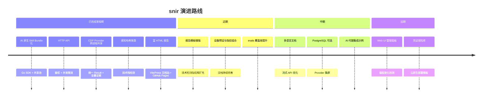
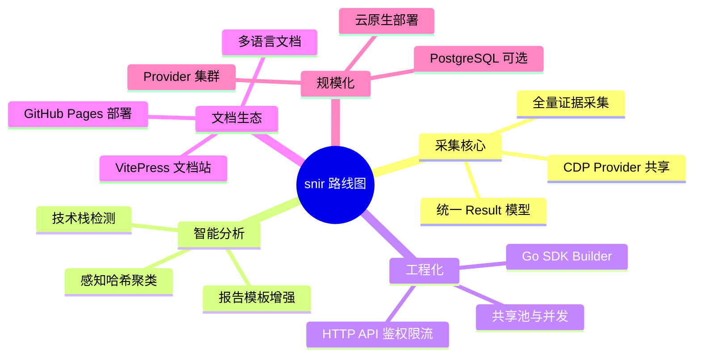

# 路线图

🗺️ snir 未来发展方向。

::: tip 说明
本路线图为方向性展望，不代表承诺。欢迎在 [Issue](https://github.com/cyberspacesec/snir-skills/issues) 讨论。
:::

## 近期

- 📊 报告模板增强与可定制化
- 🔍 技术检测指纹库扩充
- 🎭 更多设备预设与指纹组合
- 📚 文档站持续完善（每个模块、每个功能点）
- 🧪 evals 覆盖率提升

## 中期

- 🌐 多语言文档（英文版）
- ⚡ 流式 API 响应优化
- 🗄️ 更多存储后端（PostgreSQL 可选）
- 🔌 Provider 集群与负载均衡
- 🤖 更多 AI 代理集成示例（Claude / 其他）

## 远期

- 🖥️ Web UI 管理面板
- 📈 截图变化检测与差异可视化
- 🔐 凭证保险库集成
- 🐳 云原生部署模板

## 已完成里程碑

- ✅ AI 原生 Skill Bundle 化
- ✅ Go SDK（Builder 模式 + 共享池）
- ✅ HTTP API（鉴权 + 并发限流）
- ✅ CDP Provider 跨进程共享
- ✅ 统一 Result 模型 + 全量证据
- ✅ 感知哈希聚类
- ✅ 技术栈检测
- ✅ 富 HTML 报告
- ✅ VitePress 文档站 + GitHub Pages 部署

各阶段工作按领域归纳如下：

## 下一步

- [贡献指南](./contributing)
- [更新日志](../reference/changelog)
- [GitHub Issue](https://github.com/cyberspacesec/snir-skills/issues)
