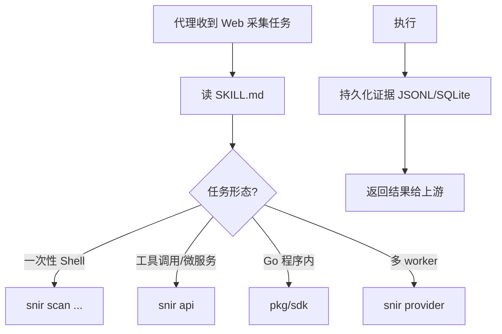

# AI 代理集成

<p align="center">🤖 让 AI 代理学会使用 snir。</p>

snir 被设计为 AI 优先。代理可通过 Skill Bundle 自发现能力，选择合适集成模式，完成任务。

## 代理工作流



## 自发现入口

代理克隆仓库后，第一步读 `SKILL.md`：

- frontmatter 的 `description` 告诉代理"何时用此技能"
- 简短指令告诉代理"怎么装、怎么跑"
- 渐进文档指引告诉代理"需要细节时打开哪个 reference"

## 选择集成模式

| 代理形态 | 推荐模式 |
|---------|---------|
| Shell 能力代理（如 Claude Code） | CLI `snir scan` |
| 工具调用框架（HTTP 工具） | HTTP API `snir api` |
| 生成 Go 代码的代理 | Go SDK |
| 多进程 worker 编排 | CDP Provider + `--wss` |

## 典型任务示例

### 任务 1：给一批 URL 截图并存证据

代理判断：一次性批量 → CLI。

```bash
snir scan file -f urls.txt --threads 10 \
  --full-page --save-html --save-headers \
  --write-jsonl --db
```

代理读 `results.jsonl` 或查 SQLite，把摘要返回上游。

### 任务 2：作为常驻工具供其他系统调用

代理判断：微服务 → HTTP API。

```bash
snir api --host 127.0.0.1 --port 8080 --api-key $KEY
```

代理用 `curl` 或 HTTP 工具调用 `/screenshot`、`/batch`。

### 任务 3：多 worker 并发采集

代理判断：资源复用 → Provider。

```bash
snir provider              # 主进程启动共享 Chrome
# 各 worker
snir scan ... --wss ws://host:9222/devtools/browser/<id>
```

## 证据持久化建议

代理应优先使用结构化输出，便于下游解析：

- `--write-jsonl`：流式，适合追加管线
- `--db`：SQLite，适合查询与长期存储

每条结果带 `schema_version`，代理可校验兼容性。见 [Result Schema](../reference/result-schema)。

## 安全约束

代理须在授权范围内操作。默认黑名单屏蔽内网与云元数据地址，防 SSRF。代理不应绕过黑名单扫描未授权资产。见 [安全注意](../advanced/security)。

## evals 验证

`evals/evals.json` 提供评估提示，可检验代理是否正确使用 snir。开发代理集成时可据此回归。

## 下一步

- [Skill Bundle](./skill-bundle)
- [集成模式](./integration-modes)
- [CLI 总览](../cli/overview)
- [HTTP API](../api/overview)
