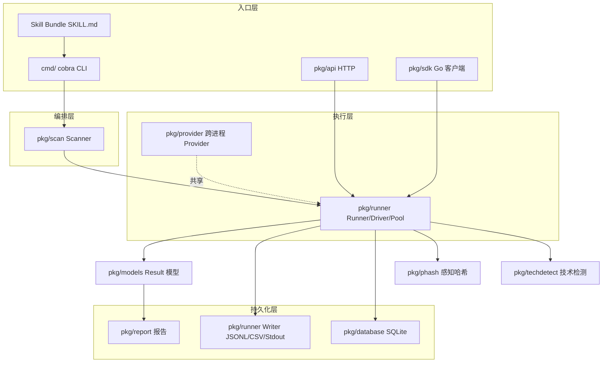
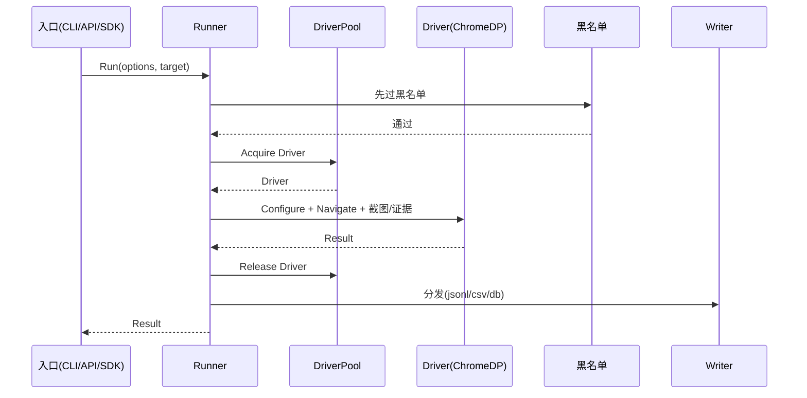

# 整体架构

🏗️ snir 的分层架构与模块协作关系。

## 分层总览

snir 采用"入口层 → 编排层 → 执行层 → 持久化层"分层，多入口共享同一套执行内核。

## 各层职责

### 入口层

::: info 四种调用形态
详见 [集成模式](./integration-modes)。所有入口最终都汇聚到 Runner，改一处全模式受益。
:::

| 入口 | 包 | 形态 |
|------|----|------|
| CLI | `cmd/` | cobra 命令（`scan`/`api`/`provider`/`report`/`webserve`/`version`） |
| HTTP API | `pkg/api` | HTTP server |
| Go SDK | `pkg/sdk` | Builder 模式类型化客户端 |
| Skill Bundle | `SKILL.md` | AI 代理自发现入口 |

### 编排层

- `pkg/scan` — `Scanner` 负责目标归一化、端口/协议展开、选择驱动模式、调用 Runner

### 执行层

::: tip 核心：pkg/runner
`pkg/runner` 是 snir 的心脏，承载了绝大多数能力：`Driver` 接口、`ChromeDP` 实现、`DriverPool`/`PoolDriver` 池、`Runner` 执行器、`Writer`、Cookie/Proxy/Blacklist/Device/Discovery。
:::

- `pkg/provider` — 跨进程共享 Chrome/CDP 端点

### 持久化层

- `pkg/runner/writer.go` — JSONL/CSV/Stdout
- `pkg/database` — SQLite（GORM）
- `pkg/report` — 富 HTML 报告、转换、合并

### 支撑模块

| 包 | 职责 |
|----|------|
| `pkg/models` | 统一 `Result` 模型与 schema 版本 |
| `pkg/phash` | 感知哈希与聚类 |
| `pkg/techdetect` | 技术栈指纹检测 |
| `pkg/log` | 彩色结构化日志 |
| `pkg/islazy` | 文件/目录/字符串工具 |
| `pkg/ascii` | Logo 与版本信息 |

Runner 内部各组件协作完成一次采集的时序：

## 关键设计：多入口共享内核

无论从 CLI、HTTP 还是 SDK 进入，最终都构造 `Options` → 走 `Runner` → 经 `Driver` 与 Chrome 交互 → 产出 `Result` → 分发 `Writer`。这保证了行为一致性与证据一致性。

::: warning 一致性保证
因为四入口共用同一 Runner，所以 **CLI 截图的行为 = API 截图 = SDK 截图**。证据字段、黑名单过滤、超时语义在任何入口下都一致，不会出现"换入口就换行为"。
:::

## 模块行数概览

| 包 | 规模（约） | 职责密度 |
|----|-----------|---------|
| `pkg/sdk` | 10k 行 | 🟥 最厚，Builder + 客户端 + 共享池 |
| `pkg/runner` | 9k 行 | 🟥 执行内核 |
| `pkg/api` | 5k 行 | 🟧 HTTP 服务 |
| `pkg/report` | 3k 行 | 🟨 报告 |
| `pkg/scan` | 2k 行 | 🟩 编排 |
| `pkg/provider` | 1.4k 行 | 🟩 跨进程 |
| `pkg/database` | 1.3k 行 | 🟩 持久化 |
| `pkg/techdetect` | 1k 行 | 🟩 指纹 |
| `pkg/phash` | 0.5k 行 | 🟩 哈希 |

## 下一步

- [集成模式](./integration-modes)：四种入口详解
- [数据流](./data-flow)：一次截图的完整时序
- [内部模块总览](../internals/overview)：逐包深入
