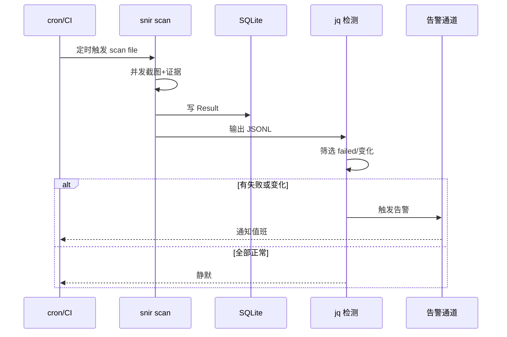
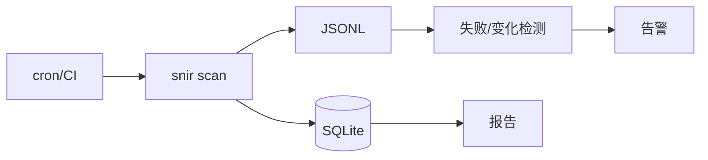

# 自动化巡检场景

<p align="center">🔄 用 snir 做定时巡检与回归。</p>

## 典型场景

- ⏰ 定时批量截图，监控资产可达性
- 📈 页面变化检测（结合感知哈希）
- 🔁 失败重试与告警
- 🧪 回归：发版后检查页面是否仍正常

## 定时任务（cron）

```bash
# 每天凌晨巡检
0 3 * * * cd /opt/snir && snir scan file -f assets.txt \
  --threads 10 --full-page --save-html \
  --write-jsonl --db --db-path $(date +\%F).db
```

## CI 集成（GitHub Actions）

```yaml
name: web-check
on:
  schedule:
    - cron: '0 3 * * *'
jobs:
  scan:
    runs-on: ubuntu-latest
    steps:
      - uses: actions/checkout@v4
      - name: 安装 Chrome
        run: sudo apt-get update && sudo apt-get install -y chromium
      - name: 批量巡检
        run: |
          ./snir scan file -f urls.txt --threads 10 \
            --write-jsonl --db
      - uses: actions/upload-artifact@v4
        with:
          name: web-evidence
          path: |
            results.jsonl
            *.db
            screenshots/
```

## 流式管线

JSONL 适合追加式管线，可被下游脚本逐行处理：

```bash
snir scan file -f urls.txt --threads 10 --write-jsonl --write-stdout=false | \
  jq -c 'select(.failed == true) | {url, failed_reason}'
```

## 变化检测

对比两次扫描的感知哈希：

```bash
# 今天
snir scan file -f urls.txt --write-jsonl --jsonl-file today.jsonl
# 距离阈值判断变化（用 phash.Distance）
```

见 [感知哈希](../advanced/perceptual-hash)。

## 失败重试

`--max-retries` 控制单目标重试次数：

```bash
snir scan file -f urls.txt --max-retries 3 --write-jsonl
```

## 告警思路

`Failed` 字段为 true 的结果可触发告警：

```bash
if jq -e 'select(.failed == true)' today.jsonl | grep -q .; then
  # 发告警
fi
```

巡检从触发到告警的完整时序：



## 工作流



## 下一步

- [CI/CD 集成](../advanced/cicd)
- [输出格式](../advanced/output-formats)
- [故障排查](../advanced/troubleshooting)
- [内容监控](./monitoring)
