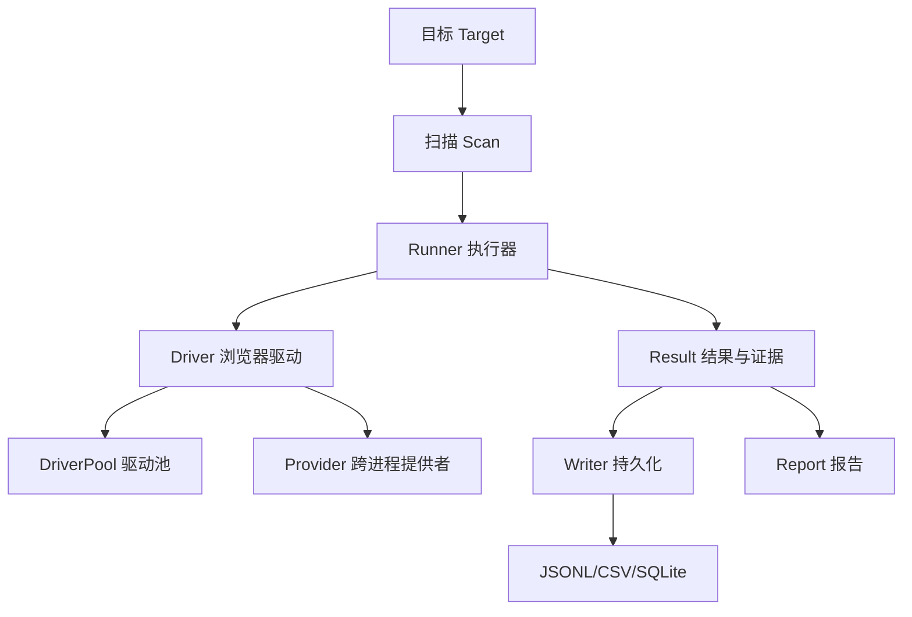

# 核心概念

🧭 理解 snir 必备的关键术语与心智模型。

## 概念地图

## 1. 目标（Target）

snir 的输入。可以是：

- **单 URL**：`example.com` / `https://example.com/path`
- **URL 列表文件**：`-f urls.txt`
- **CIDR 网段**：`192.168.1.0/24`
- **裸 host/IP + 端口展开**：`-f hosts.txt --ports 80,443,8080`

`--ports` 会把裸 host/IP 展开成多个候选 URL（`http://host:port`、`https://host:port`），是 **Web 候选展开**，不是端口扫描。

## 2. 扫描（Scan）

`pkg/scan` 中的 `Scanner` 负责把"目标"变成"一次浏览器执行"。它处理：

- 目标归一化（补协议、解析 host/port）
- 端口与协议展开（`ExpandTargets`）
- 选择驱动模式（单驱动 vs 池化）
- 调用 `Runner` 执行单次截图

## 3. Runner 执行器

`pkg/runner` 是核心。`Runner` 持有一个 `Driver` 和一组 `Writer`，负责：

- 驱动浏览器导航到目标
- 配置视口、设备、代理、Cookie、JS
- 执行交互动作（点击、输入、表单、等待）
- 捕获截图与各类证据
- 把 `Result` 分发给所有 `Writer` 持久化

## 4. Driver 驱动

`Driver` 是浏览器抽象接口。当前主要实现是 `ChromeDP`——基于 chromedp/cdproto 的 CDP 驱动。Driver 负责"一次真实的浏览器会话"。

## 5. DriverPool 驱动池

浏览器很贵，所以 snir 用 `DriverPool` 复用一批 `Driver`：

- 并发任务从池里借一个空闲 Driver，用完归还
- 池统计：活跃/空闲/等待/累计
- 共享池单例（`InitSharedPool`）让进程内多任务复用同一池

详见 [并发与池](../advanced/concurrency)。

## 6. Provider 跨进程提供者

`snir provider` 启动一个常驻 Chrome/CDP 端点，让**多个进程**的 worker 连接复用——避免每个进程都各自拉 Chrome。适合多 agent / 多 worker 场景。

## 7. Result 结果与证据

一次采集的统一产出，定义在 `pkg/models`。关键字段：

| 字段 | 含义 |
|------|------|
| `URL` / `FinalURL` | 请求 URL 与最终跳转后 URL |
| `ResponseCode` / `ResponseReason` | HTTP 状态码与原因 |
| `Title` / `HTML` | 页面标题与 HTML 源码 |
| `Headers` / `Cookies` / `ConsoleLogs` / `NetworkLogs` | 各类证据 |
| `TLS` | TLS 证书信息 |
| `Technologies` | 识别出的技术栈 |
| `PerceptionHash` | 感知哈希（用于聚类与去重） |
| `Screenshot` / `ScreenshotBytes` | 截图路径或内存字节 |
| `Failed` / `FailedReason` | 失败标记与原因 |
| `SchemaVersion` | 结果 schema 版本（`snir-skills.result.v1`） |

完整字段见 [Result Schema](../reference/result-schema)。

## 8. Writer 持久化

`Writer` 接口把 `Result` 写到不同目的地：

- `JSONLWriter`：流式 JSONL，适合管线追加
- `CSVWriter`：表格化，适合 Excel/分析
- `StdoutWriter`：控制台
- `DBWriter`（`pkg/database`）：SQLite，结构化查询

## 9. 集成模式

四种调用形态，共享同一套 Runner 能力：

| 模式 | 入口 | 适合 |
|------|------|------|
| Skill Bundle | `SKILL.md` | AI 代理自发现 |
| CLI | `snir scan/api/provider/report` | 人类 / Shell 代理 |
| HTTP API | `snir api` | 非 Go 系统、微服务 |
| Go SDK | `pkg/sdk` | Go 应用类型化集成 |
| CDP Provider | `snir provider` | 多进程共享 Chrome |

## 10. Skill Bundle

仓库根目录就是一个 Anthropic 兼容技能包：

- `SKILL.md`：入口（frontmatter + 简短操作指令）
- `references/`：按需加载的任务文档
- `scripts/`：让执行更确定的脚本（如 `install-snir.sh`）
- `evals/`：评估代理能否正确使用 snir 的测试提示

## 下一步

- [整体架构](./architecture)：这些概念如何在代码层落地
- [集成模式](./integration-modes)：选哪种调用形态
- [快速开始](./quick-start)：跑起来
