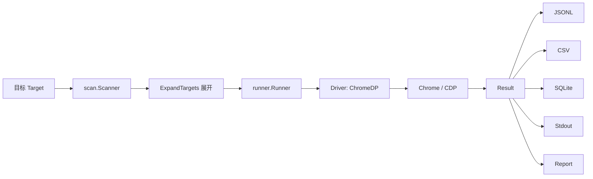
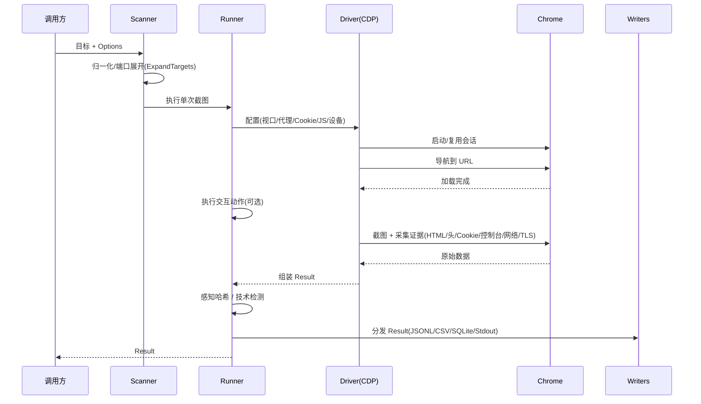

# 数据流

🌊 一次截图从输入到产出的完整数据流。

## 总览

## 时序

## 各阶段详解

### 1. 目标输入

单 URL、文件列表、CIDR、裸 host+端口。见 [核心概念](./core-concepts)。

### 2. 归一化与展开

`scan.ExpandTargets` 把裸 host/IP 按协议与端口展开为候选 URL 列表。`models.EnrichEndpoint` 补全 host/port/scheme/endpoint。

### 3. Runner 执行

`Runner` 持 `Driver` + `[]Writer`，按 `Options` 配置浏览器，导航、执行交互、采集。

### 4. Driver 与 Chrome

`ChromeDP` 经 CDP 与 Chrome 通信：设置视口、注入 Cookie、应用指纹、走代理、注入 JS、触发动作、截图、抓证据。

### 5. Result 组装

浏览器原始数据组装为 `models.Result`，补 `schema_version`、`probed_at`、感知哈希、技术栈。

### 6. 持久化分发

`Result` 同时分发给所有启用的 `Writer`：JSONL（追加）、CSV（表格）、SQLite（结构化）、Stdout（控制台）。可再生成报告。

## 并发与池

批量时，多个目标并发从 `DriverPool` 借 Driver，复用浏览器实例。见 [并发与池](../advanced/concurrency)。

## 下一步

- [架构](./architecture)
- [Result Schema](../reference/result-schema)
- [输出格式](../advanced/output-formats)
