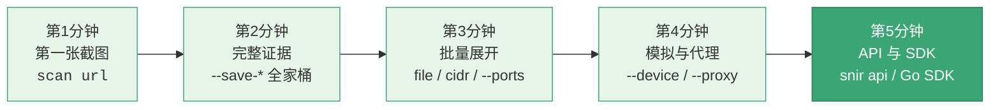

# 五分钟教程

<p align="center">⏱️ 从零到熟练，循序渐进掌握 snir。</p>

假设已 [安装](./installation) 完成，`snir version` 可用。

本教程按 5 个分钟递进，每分钟解锁一层能力：



## 第 1 分钟：第一张截图

```bash
snir scan example.com
```

截图存于 `./screenshots/`。

## 第 2 分钟：完整证据

```bash
snir scan example.com \
  --full-page \
  --save-html --save-headers --save-cookies \
  --save-console --save-network \
  --write-jsonl --db
```

一次拿到截图 + HTML + 头 + Cookie + 控制台 + 网络，写入 JSONL 与 SQLite。

## 第 3 分钟：批量与展开

```bash
# 批量 URL
snir scan file -f urls.txt --threads 10

# 裸 host/IP 按端口展开
snir scan file -f hosts.txt --ports 80,443,8080

# 网段
snir scan cidr 192.168.1.0/24
```

## 第 4 分钟：模拟与代理

```bash
# 设备模拟
snir scan example.com --device iphone-15
snir scan --list-devices

# 代理
snir scan example.com --proxy http://127.0.0.1:8080

# 代理轮换
snir scan file -f urls.txt \
  --proxy-list http://p1:8080 --proxy-list http://p2:8080 \
  --proxy-strategy round-robin
```

## 第 5 分钟：API 与 SDK

### HTTP API

```bash
snir api --host 127.0.0.1 --port 8080 --api-key secret
```

```bash
curl -X POST http://127.0.0.1:8080/screenshot \
  -H "X-API-Key: secret" -H "Content-Type: application/json" \
  -d '{"url":"example.com","save_html":true}'
```

### Go SDK

```go
package main

import (
    "fmt"
    "github.com/cyberspacesec/snir-skills/pkg/sdk"
)

func main() {
    result, err := sdk.SharedCapture("https://example.com",
        sdk.WithFullPage(),
        sdk.WithHTML(),
        sdk.WithHeaders(),
    )
    if err != nil { panic(err) }
    fmt.Println(result.Title, result.ResponseCode)
}
```

## 恭喜 🎉

你已掌握 snir 核心用法。继续深入：

- [进阶主题](../advanced/proxy)：指纹、Cookie、JS、表单
- [CLI 全标志](../reference/cli-flags)
- [Go SDK](../sdk/overview)
- [报告生成](../advanced/reports)
