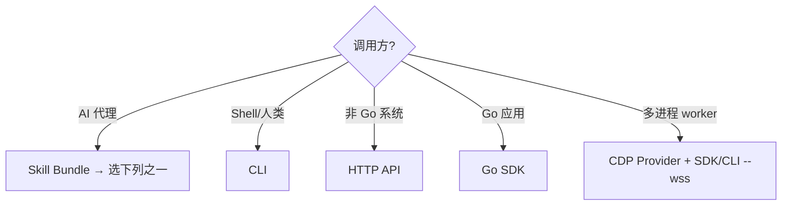
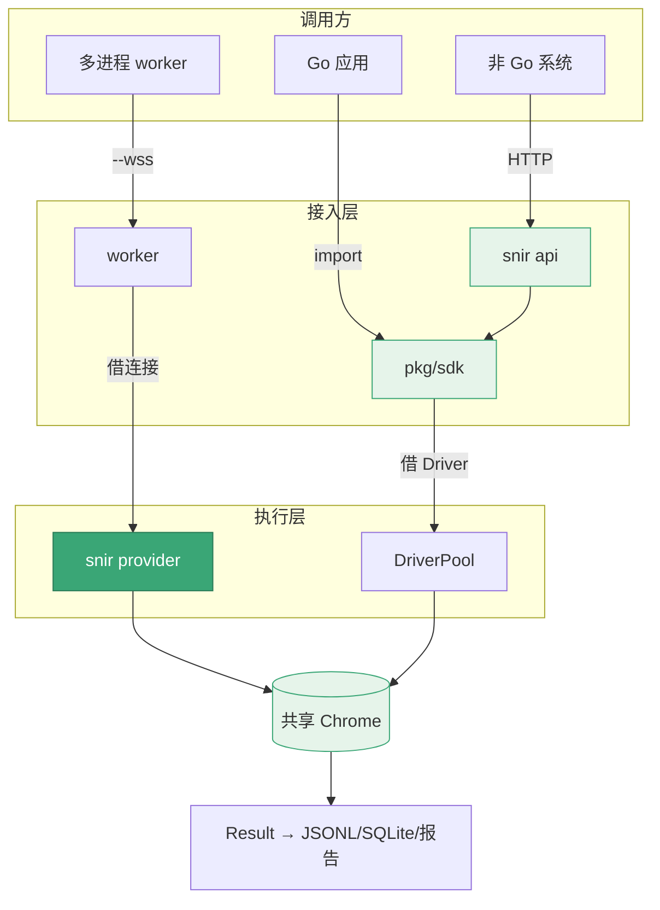

# 集成模式

<p align="center">🔌 四种集成模式：选最适合你的调用形态。</p>

snir 同一能力可通过五种入口访问。选哪种取决于调用方形态。

## 模式对比

| 模式 | 入口 | 适合 | 返回形态 |
|------|------|------|---------|
| 🤖 Skill Bundle | `SKILL.md` | AI 代理自发现 | 引导到下述模式 |
| 🖥️ CLI | `snir scan/api/...` | 人类 / Shell 代理 | 文件 + 控制台 |
| 🌐 HTTP API | `snir api` | 非 Go 系统、微服务 | JSON / 图片字节 |
| 🧩 Go SDK | `pkg/sdk` | Go 应用 | 类型化 Result |
| 🔌 CDP Provider | `snir provider` | 多进程共享 Chrome | 复用连接 |

## 决策树



## 1. Skill Bundle（AI 优先）

仓库根就是 Anthropic 兼容技能包。代理读 `SKILL.md` 获得简短操作指令，按需打开 `references/`。详见 [Skill Bundle](./skill-bundle)、[AI 代理集成](./ai-agent)。

## 2. CLI

最直接的形态。适合人类操作或 Shell 代理。

```bash
snir scan example.com --full-page --save-html --write-jsonl
```

特点：产出文件 + 控制台输出，无需写代码。见 [CLI 总览](../cli/overview)。

## 3. HTTP API

启动常驻服务，供任何语言调用。

```bash
snir api --host 127.0.0.1 --port 8080 --api-key secret
```

```bash
curl -X POST http://127.0.0.1:8080/screenshot \
  -H "X-API-Key: secret" -H "Content-Type: application/json" \
  -d '{"url":"example.com","save_html":true}'
```

特点：语言中立、支持并发限流与批量。见 [HTTP API](../api/overview)。

## 4. Go SDK

类型化集成，Builder 模式选项，共享池复用。

```go
import "github.com/cyberspacesec/snir-skills/pkg/sdk"

client, _ := sdk.NewClient(sdk.DefaultClientOptions())
result, _ := sdk.SharedCapture("https://example.com",
    sdk.WithFullPage(),
    sdk.WithHTML(),
)
```

特点：类型安全、内存字节、流式批量。见 [SDK 总览](../sdk/overview)。

## 5. CDP Provider

常驻 Chrome 端点，多进程复用。

```bash
snir provider   # 启动共享 Chrome
# 其他进程
snir scan example.com --wss ws://host:9222/devtools/browser/<id>
```

特点：跨进程资源复用，降本增效。见 [provider](../cli/provider)、[远程 Chrome](../advanced/remote-chrome)。

## 组合使用

模式可组合。例如：HTTP API 后端用 Go SDK 调内核，多 worker 经 CDP Provider 共享 Chrome。

典型的"API + SDK + Provider"组合架构：



## 下一步

- [快速开始](./quick-start)
- [架构](./architecture)
- [AI 代理集成](./ai-agent)
