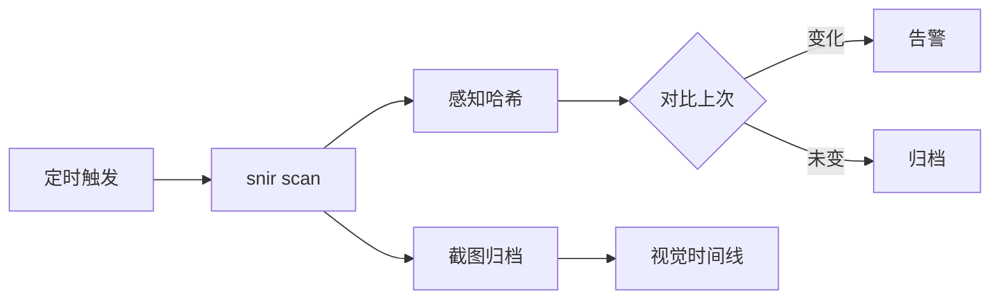

# 内容监控场景

<p align="center">👁️ 用 snir 监控页面变化与合规。</p>

## 典型场景

- 📸 定期截图存档，形成视觉时间线
- 🧮 感知哈希检测页面改版
- 🚨 关键页面变化告警
- 📋 合规留痕

## 视觉时间线

定期截图，按日期归档：

```bash
DATE=$(date +%F)
mkdir -p archive/$DATE
snir scan file -f watch.txt \
  --screenshot-path archive/$DATE \
  --write-jsonl --jsonl-file archive/$DATE/results.jsonl
```

## 变化检测（感知哈希）

snir 自动为每张截图计算感知哈希。对比两次哈希距离即可判断是否改版：

- 距离小 → 页面基本未变
- 距离大 → 发生改版

```bash
# 用 SDK 的 phash.Distance 比较两次结果
# 或在 SQLite 中按 perception_hash_group_id 聚类
```

详见 [感知哈希](../advanced/perceptual-hash)。

## 关键页面告警

监控登录页、首页、合规声明等关键页：

```bash
snir scan example.com --selector "#main" --save-html \
  --write-jsonl
# 下游脚本对比 HTML 摘要或哈希
```

## 状态码监控

```sql
SELECT probed_at, host, response_code
FROM screenshots
WHERE response_code >= 400 OR failed = 1;
```

## 报告归档

```bash
snir report html -i results.jsonl -o weekly.html
snir webserve --dir .
```

## 工作流



## 下一步

- [感知哈希](../advanced/perceptual-hash)
- [报告生成](../advanced/reports)
- [自动化巡检](./automation)
- [数据库存储](../advanced/database)
