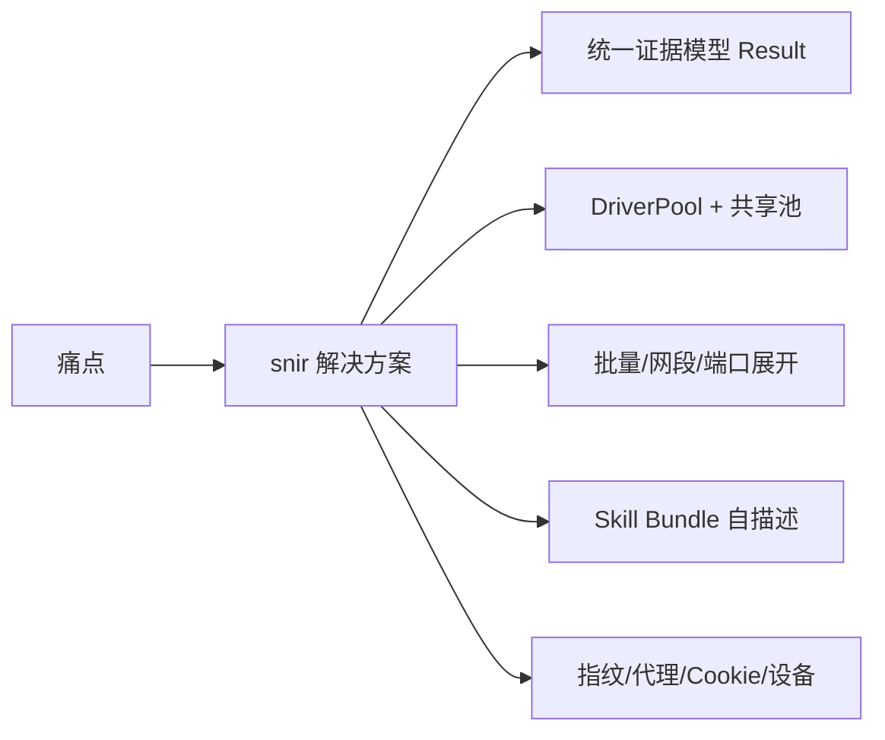

# 解决什么问题

<p align="center">🎯 这一页解释 snir 诞生的动机，以及它如何系统性地解决问题。</p>

## 痛点：Web 取证"看似简单，实则繁琐"

当你（或你的 AI 代理）需要对一个网站做"采集 + 取证"时，通常会撞上这些问题：

### 1. 截图容易，证据难

`curl` 拿 HTML、`chrome --screenshot` 拿截图、自己写脚本抓 Cookie——工具零散、结果格式不一、难以关联。**"这张截图对应哪次请求？状态码多少？跳转去哪了？"** 往往答不上来。

### 2. 批量与并发难

单页好办，一到批量（URL 列表、CIDR 网段、host 端口展开）就涉及并发控制、重试、失败隔离、结果流式写出。从零造轮子既费时又易错。

### 3. 浏览器资源昂贵

每个任务都拉起一个 Chrome 进程，几十个并发就把机器吃满。**如何让多任务复用同一批浏览器实例？如何跨进程共享？** 这不是业务问题，却是工程现实。

### 4. AI 代理"不知道怎么用"

AI 代理拿到一个新仓库，要花大量 token 去理解"怎么装、怎么调、哪个入口对"。**没有自描述的技能入口**，集成成本高昂。

### 5. 反检测与模拟难

真实采集常被反爬阻断：UA 检测、指纹检测、IP 封禁。设备模拟、指纹伪装、代理轮换、Cookie 持久化——每一项都得自己实现。

## snir 如何解决

snir 用"一个子系统，多种集成模式"的思路，把上述痛点一次性收口：



| 痛点 | snir 的解法 | 对应文档 |
|------|------------|---------|
| 证据难 | 统一 `Result` 模型，一次采集同时产出截图+HTML+头+Cookie+控制台+网络+TLS+状态码，带 `schema_version` | [Result Schema](../reference/result-schema)、[证据采集](../advanced/evidence) |
| 批量并发难 | `scan file` / `scan cidr` / 端口展开 + `DriverPool` 并发池 + 重试 + 流式写出 | [scan-file](../cli/scan-file)、[并发与池](../advanced/concurrency) |
| 浏览器昂贵 | `DriverPool` 进程内复用 + 共享池单例 + 跨进程 `snir provider` | [共享池](../sdk/shared)、[provider](../cli/provider) |
| AI 不会用 | Skill Bundle：`SKILL.md` 入口 + `references/` 渐进文档 + `evals/` 评估 | [Skill Bundle](./skill-bundle)、[AI 代理集成](./ai-agent) |
| 反检测 | 设备预设、浏览器指纹伪装、代理列表/文件/API 轮换、Cookie 持久化与 Netscape 导入导出 | [设备模拟](../advanced/device)、[指纹](../advanced/fingerprint)、[代理](../advanced/proxy)、[Cookie](../advanced/cookie) |

## 价值：从"零散脚本"到"可采信的情报管线"

用一个对比例子说明。**目标：对 1000 个 URL 批量截图并留存证据。**

### 没有 snir

- 写 shell 循环跑 `chrome --screenshot`，并发靠 `xargs -P`
- 截图有了，但 HTML/头/Cookie 散落各处，无法与截图关联
- 失败重试、限流、黑名单都要手写
- 下游分析要自己解析文件名、目录结构

### 用 snir

```bash
snir scan file -f urls.txt --threads 20 \
  --full-page --save-html --save-headers --save-cookies \
  --save-console --save-network \
  --write-jsonl --db
```

一行命令完成：并发截图、全量证据、JSONL 流式 + SQLite 结构化、内置黑名单与重试。下游直接读 `results.jsonl` 或查 SQLite，每条记录都自带 `schema_version` 与完整字段。

## 适用与不适用

### ✅ 适合

- 安全侦察中的 Web 资产盘点与截图存档
- 内容监控（页面变化、感知哈希聚类）
- 自动化巡检与回归（页面是否仍可达、是否改版）
- AI 代理的浏览器工具调用
- 批量 URL / 网段 / host 端口展开采集

### ⚠️ 需注意

- 须在授权范围内扫描第三方资产
- 截图需要 Chrome/Chromium（除非用远程 CDP）
- 不是漏洞扫描器，不主动探测漏洞

## 下一步

- [核心概念](./core-concepts)：理解 Result、Driver、Pool、Provider 等关键术语
- [整体架构](./architecture)：看 snir 各层如何协作
- [快速开始](./quick-start)：装好就跑
