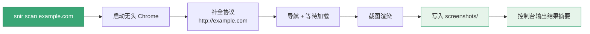
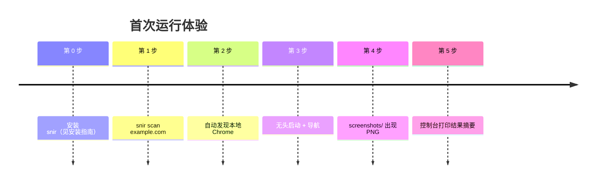

# 快速开始

<p align="center">🚀 五分钟内跑出你的第一张截图与证据。</p>

## 前置条件

- **操作系统**：Linux / macOS / FreeBSD / OpenBSD / NetBSD
- **Chrome 或 Chromium**：截图依赖本地浏览器，或指向一个远程 CDP 端点（`--wss`）
- **（可选）Go 1.23+**：仅当从源码构建时需要

::: tip 💡 没有本地 Chrome？
可以连接远程 Chrome：`snir scan example.com --wss ws://host:9222/devtools/browser/xxx`，详见 [远程 Chrome](../advanced/remote-chrome)。
:::

## 安装

### 方式一：脚本安装（推荐）

仓库已克隆时：

```bash
./scripts/install-snir.sh
snir version
```

### 方式二：下载预编译二进制

```bash
LATEST=$(curl -s https://api.github.com/repos/cyberspacesec/snir-skills/releases/latest | grep '"tag_name"' | sed -E 's/.*"([^"]+)".*/\1/')
OS=$(uname -s)
ARCH=$(uname -m | sed 's/x86_64/x86_64/;s/aarch64/arm64/;s/arm64/arm64/')
curl -L -o snir.tar.gz "https://github.com/cyberspacesec/snir-skills/releases/download/${LATEST}/snir-skills_${OS}_${ARCH}.tar.gz"
tar xzf snir.tar.gz snir && chmod +x snir && sudo mv snir /usr/local/bin/
snir version
```

### 方式三：源码构建

```bash
make build
./snir version
```

## 第一张截图

最简一行命令：

```bash
snir scan example.com
```

从敲下命令到拿到截图，snir 内部的执行流程如下：



新用户从安装到拿到第一张截图的典型时间线：



这会：

1. 启动无头 Chrome
2. 导航到 `http://example.com`（自动补协议）
3. 截图保存到 `./screenshots/` 目录
4. 在控制台输出结果

## 采集完整证据

加上证据开关，一次拿全：

```bash
snir scan example.com \
  --full-page \
  --save-html --save-headers --save-cookies \
  --save-console --save-network \
  --write-jsonl
```

| 选项 | 产出 |
|------|------|
| `--full-page` | 完整页面截图（含滚动区域） |
| `--save-html` | HTML 源码 |
| `--save-headers` | HTTP 响应头 |
| `--save-cookies` | Cookie |
| `--save-console` | 控制台日志 |
| `--save-network` | 网络请求日志 |
| `--write-jsonl` | 写入 `results.jsonl` |

::: details 结果会是什么样？
每行一个完整 `Result` JSON，含截图路径、状态码、标题、HTML、headers、cookies、console、network 等全部字段：

```json
{"url":"http://example.com","final_url":"...","response_code":200,
 "title":"Example Domain","screenshot":"screenshots/...png",
 "html":"<!doctype html>...","headers":[...],"cookies":[...],
 "console":[...],"network":[...],"schema_version":"snir-skills.result.v1"}
```

用 `jq` 查看：`jq -c '{url,title,code:.response_code}' results.jsonl`
:::

## 批量扫描

从文件批量：

```bash
snir scan file -f urls.txt --threads 10 --write-jsonl --db
```

::: tip 推荐组合
批量场景标配 `--threads 10 --write-jsonl --db`：并发跑、流式落 JSONL、同时入库 SQLite 便于查询。`--threads` 建议从 5-10 起步，视目标限流调整。
:::

展开裸 host/IP 的常见 Web 端口：

```bash
snir scan file -f hosts.txt --ports 80,443,8080,8443 --write-jsonl --db
```

扫描网段：

```bash
snir scan cidr 192.168.1.0/24
```

## 启动 HTTP API

```bash
snir api --host 127.0.0.1 --port 8080 --api-key secret
```

::: warning 生产环境安全
- 监听内网 `--host 127.0.0.1`，除非确需公网
- `--api-key` 用强随机值，不要提交到代码库
- 公网暴露务必前置 HTTPS 反代
:::

调用：

```bash
curl -X POST http://127.0.0.1:8080/screenshot \
  -H "X-API-Key: secret" -H "Content-Type: application/json" \
  -d '{"url":"example.com","save_html":true}'
```

## 常用输出

::: info 产物速查
- 📁 `screenshots/` — 截图文件
- 📄 `results.jsonl` — 流式结构化结果
- 📊 `results.csv` — 表格化结果（`--write-csv`）
- 🗄️ `go-web-screenshot.db` — SQLite（`--db`）
:::

## 下一步

- [安装](./installation)：详细安装与平台注意事项
- [五分钟教程](./five-minutes)：循序渐进掌握更多能力
- [CLI 总览](../cli/overview)：所有命令一览
- [进阶主题](../advanced/proxy)：代理、设备、指纹、Cookie 等
