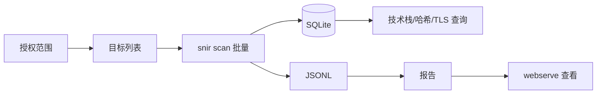

# 安全侦察场景

<p align="center">🛡️ 用 snir 做 Web 资产盘点与情报采集。</p>

::: warning 授权
仅对授权范围内的资产进行扫描。snir 默认黑名单屏蔽内网与云元数据地址以防 SSRF。见 [安全注意](../advanced/security)。
:::

## 典型场景

- 🗺️ Web 资产盘点：批量截图存档，建立资产视觉清单
- 🌐 网段扫描：发现网段内 Web 服务
- 🔌 端口展开：对 host/IP 探测常见 Web 端口
- 🔍 技术栈识别：识别框架/CMS/CDN
- 🧮 感知哈希聚类：相似页面归组，发现模板站与钓鱼
- 🗄️ 结构化存储：SQLite 便于查询与关联

## 资产盘点

```bash
snir scan file -f assets.txt --threads 10 \
  --full-page --save-html --save-headers \
  --write-jsonl --db
```

产出：截图 + 全量证据 + JSONL + SQLite。

## 网段扫描

```bash
snir scan cidr 10.0.1.0/24 --threads 20 --write-jsonl --db
```

## 端口展开

```bash
snir scan file -f hosts.txt --ports 80,443,8080,8443,8000,8888 \
  --write-jsonl --db
```

## 技术栈识别

证据采集中自动识别技术栈，存入 `technologies` 字段。查询 SQLite：

```sql
SELECT host, group_concat(name) FROM technologies
GROUP BY host;
```

见 [技术检测](../advanced/tech-detection)。

## 相似页面聚类

感知哈希自动计算并聚类，相似页面归同 `perception_hash_group_id`：

```sql
SELECT perception_hash_group_id, count(*), group_concat(host)
FROM screenshots
GROUP BY perception_hash_group_id
HAVING count(*) > 1;
```

见 [感知哈希](../advanced/perceptual-hash)。

## TLS 证书审计

`--save-headers` 等证据采集中捕获 TLS 信息（颁发者、过期时间、SANs、指纹）：

```sql
SELECT host, issuer, not_after FROM tls WHERE not_after < date('now','+30 days');
```

## 报告生成

```bash
snir report html -i results.jsonl -o report.html
snir webserve --dir .
```

见 [报告生成](../advanced/reports)。

## 工作流



## 下一步

- [批量扫描](../cli/scan-file)
- [技术检测](../advanced/tech-detection)
- [感知哈希](../advanced/perceptual-hash)
- [数据库存储](../advanced/database)
