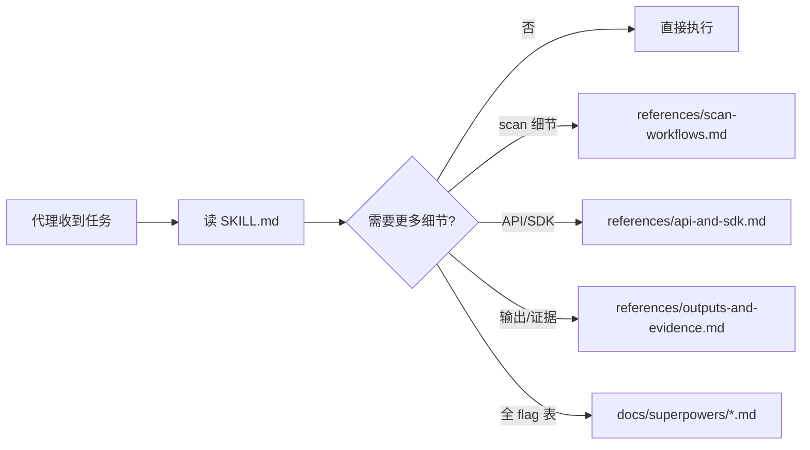
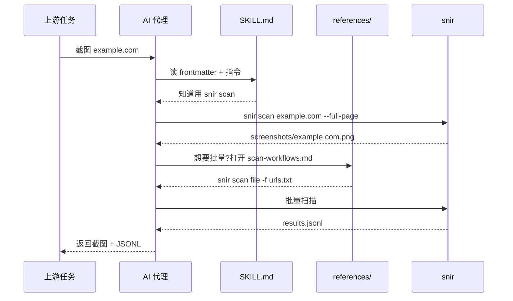

# Skill Bundle

<p align="center">🤖 snir 仓库本身就是一个 Anthropic 兼容的技能包。</p>

## 什么是 Skill Bundle

Skill Bundle 是 Anthropic 兼容的"技能"打包格式：一个入口文件 + 渐进式资源 + 脚本 + 评估。AI 代理可自发现入口，按需加载，先短后长，节省 token。

## 仓库结构

```
snir-skills/
├── SKILL.md            # 🎯 技能入口（frontmatter + 简短指令）
├── references/         # 📚 渐进式任务文档（按需打开）
│   ├── README.md       # 结构说明与何时打开哪个
│   ├── scan-workflows.md
│   ├── api-and-sdk.md
│   └── outputs-and-evidence.md
├── scripts/            # 🛠️ 让执行更确定的脚本
│   └── install-snir.sh
├── evals/              # 🧪 评估代理能否正确使用 snir
│   └── evals.json
└── docs/               # 📖 深度项目文档（保留公共链接）
```

## SKILL.md 入口

`SKILL.md` 包含：

- frontmatter：`name` 与 `description`（供代理检索匹配）
- 简短操作指令：安装、常见任务、渐进文档指引

代理读完 `SKILL.md` 就能：装好二进制、跑单页/批量/API、知道何时打开哪个 reference。

## 渐进式加载原则



代理自发现并调用 snir 的端到端时序：



只在需要时打开更深文档，避免一次性加载全部上下文。

## references/ 各文件

| 文档 | 何时打开 |
|------|---------|
| `README.md` | 了解技能包结构与何时打开各资源 |
| `scan-workflows.md` | 任务导向的 CLI 扫描模式 |
| `api-and-sdk.md` | HTTP API、Go SDK、Provider 集成 |
| `outputs-and-evidence.md` | 结果字段、持久化格式、证据采集 |

## scripts/

`install-snir.sh` 是跨平台安装脚本（Linux/macOS/BSD），让"安装"这一步确定性化，而非代理临场拼凑命令。

## evals/

`evals.json` 包含真实评估提示与期望，用于检验代理能否正确使用 snir。

## 与本文档站的关系

本 VitePress 文档站是面向人类的完整文档；Skill Bundle 面向 AI 代理的精简入口。二者互补：代理从 `SKILL.md` 进入，需要更深可链接到本站。

## 下一步

- [AI 代理集成](./ai-agent)：代理工作流示例
- [安装](./installation)
- [快速开始](./quick-start)
