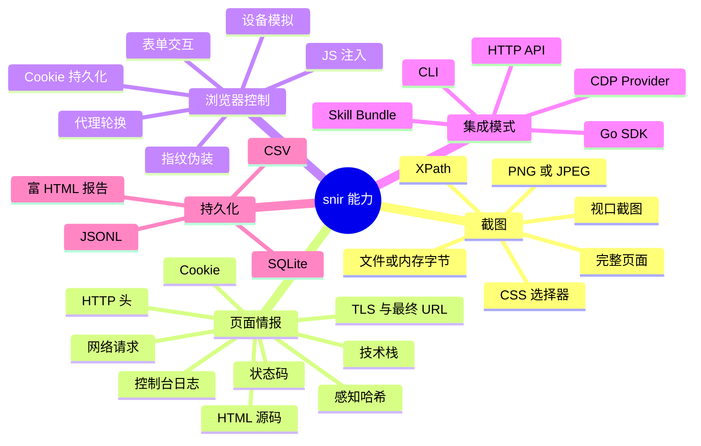

# snir 是什么

  <strong>📸 snir 是一个 AI 原生的网页截图与情报采集工具</strong>

`snir`（发音类似 "snear"）是一个基于 **Chrome DevTools Protocol (CDP)** 的网页截图与 Web 情报采集子系统。它既可被人类直接使用，更被设计为 **AI 优先（AI-first）**：一个 AI 代理可以自发现技能入口、安装二进制、选择合适的集成模式、运行截图或批量采集，并持久化结构化证据——而无需事先掌握任何 Go 语言知识。

## 一句话定义

> 给 AI 代理与自动化系统一种"浏览器级"的方式来捕获截图、页面证据与 Web 情报。

## 它不是什么

为了管理预期，先明确 snir 的边界：

| 它是 ✅ | 它不是 ❌ |
|--------|----------|
| 网页截图与证据采集器 | 端口扫描器 / TCP-UDP 探测器 |
| 基于 CDP 的浏览器自动化 | 通用爬虫框架 |
| 结构化情报持久化工具 | 渗透测试框架 |
| 多集成模式（CLI/API/SDK/Provider） | 无头浏览器库本身的替代品 |

`--ports` 用于把裸 host/IP 展开成 Web 候选 URL，并非 TCP/UDP 端口发现。

## 核心能力一览

## 设计哲学

### 1. AI 优先

snir 把 AI 代理当作一等公民。仓库本身就是一个 Anthropic 兼容的 **Skill Bundle**：`SKILL.md` 是入口，`references/` 是渐进式任务文档，`evals/` 是评估提示。代理按需加载，先短后长。

### 2. 证据可采信

截图不只是图片，而是"证据"。snir 同时捕获 HTML、HTTP 头、Cookie、控制台日志、网络请求、TLS 信息、最终 URL 与状态码，并用 `schema_version` 标记结果版本，便于下游分析与归档。

### 3. 多集成模式

不同调用方有不同形态：

- **Shell 代理** → `snir scan ...`
- **非 Go 系统 / 微服务** → `snir api`（HTTP）
- **Go 应用** → `pkg/sdk`（类型化）
- **多进程 worker** → `snir provider`（共享 Chrome）

### 4. 资源复用

浏览器是昂贵的资源。snir 提供 **DriverPool** 与共享池单例，让多任务复用同一批 Chrome 实例；并提供 **CDP Provider** 模式，让多进程共享同一个远程 Chrome。

## 项目仓库

- 🎮 GitHub: [cyberspacesec/snir-skills](https://github.com/cyberspacesec/snir-skills)
- 📄 License: MIT
- 🏗️ 语言: Go 1.23+
- 🖥️ 依赖: Chrome / Chromium（或远程 CDP 端点）

## 下一步

- 想知道 snir 解决了什么具体痛点？见 [解决什么问题](./problem-it-solves)
- 想理解关键术语？见 [核心概念](./core-concepts)
- 想立刻上手？见 [快速开始](./quick-start)
