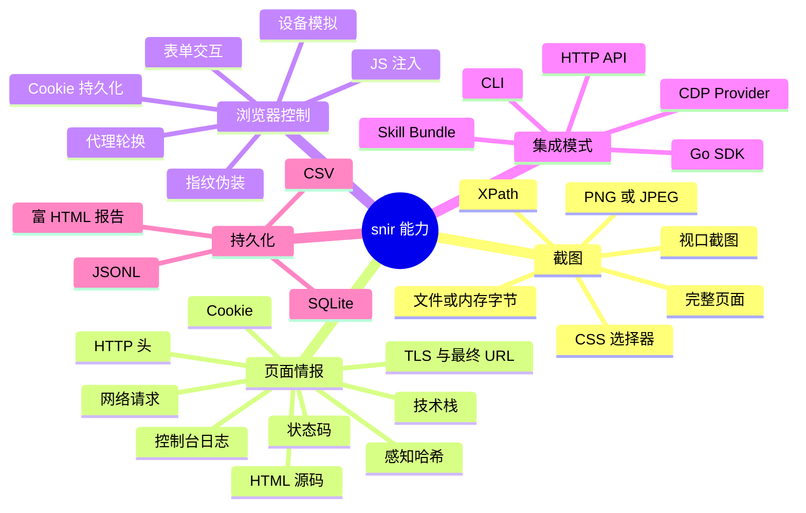
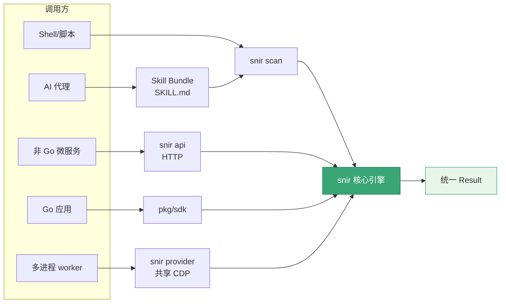

# snir 是什么

  <strong>📸 snir 是一个 AI 原生的网页截图与情报采集工具</strong>

`snir`（发音类似 "snear"）是一个基于 **Chrome DevTools Protocol (CDP)** 的网页截图与 Web 情报采集子系统。它既可被人类直接使用，更被设计为 **AI 优先（AI-first）**：一个 AI 代理可以自发现技能入口、安装二进制、选择合适的集成模式、运行截图或批量采集，并持久化结构化证据——而无需事先掌握任何 Go 语言知识。

## 一句话定义

> 给 AI 代理与自动化系统一种"浏览器级"的方式来捕获截图、页面证据与 Web 情报。

## 它不是什么

为了管理预期，先明确 snir 的边界：

| 它是 ✅ | 它不是 ❌ |
|--------|----------|
| 网页截图与证据采集器 | 端口扫描器 / TCP-UDP 探测器 |
| 基于 CDP 的浏览器自动化 | 通用爬虫框架 |
| 结构化情报持久化工具 | 渗透测试框架 |
| 多集成模式（CLI/API/SDK/Provider） | 无头浏览器库本身的替代品 |

`--ports` 用于把裸 host/IP 展开成 Web 候选 URL，并非 TCP/UDP 端口发现。

## 核心能力一览

## 设计哲学

::: tip 四个设计原则
snir 的所有功能都围绕这四条哲学展开，理解它们就能预判 snir 在边界场景的行为。
:::

### 1. AI 优先

snir 把 AI 代理当作一等公民。仓库本身就是一个 Anthropic 兼容的 **Skill Bundle**：

- `SKILL.md` — 入口，告诉代理"能做什么、怎么开始"
- `references/` — 渐进式任务文档，先短后长，按需加载
- `evals/` — 评估提示，验证代理是否用对了

::: info 典型的 AI 调用链
代理读 `SKILL.md` → 自发现集成入口 → 调 `snir scan` 或 SDK → 拿到结构化 `Result` → 继续推理。全程不需要代理事先懂 Go。
:::

### 2. 证据可采信

截图不只是图片，而是"证据"。snir 在一次截图里同时固化多种可采信的痕迹：

| 证据 | 字段 | 价值 |
|------|------|------|
| HTML 源码 | `html` | 还原当时 DOM |
| HTTP 头 | `headers` | 服务端指纹 |
| Cookie | `cookies` | 会话状态 |
| 控制台 | `console` | 前端报错 |
| 网络请求 | `network` | 请求/响应链 |
| TLS | `tls` | 证书与加密 |
| 最终 URL | `final_url` | 跳转后落点 |
| 状态码 | `response_code` | 可达性 |

每条 `Result` 带 `schema_version`，便于下游分析与归档。

### 3. 多集成模式

不同调用方有不同形态，对应不同集成入口：

### 4. 资源复用

浏览器是昂贵的资源。snir 在两个层面复用 Chrome：

- **进程内**：`DriverPool` 与共享池单例，让多任务复用同一批 Chrome 实例
- **跨进程**：`CDP Provider` 模式，让多进程 worker 共享同一个远程 Chrome 端点

::: warning 浏览器开销
每起一个 Chrome 进程约占 ~150MB 内存。批量场景务必用 `Shared*` 函数或 `snir provider`，避免每任务起停一次浏览器。
:::

## 项目仓库

::: info 仓库速览
- 🎮 **GitHub**：[cyberspacesec/snir-skills](https://github.com/cyberspacesec/snir-skills)
- 📄 **License**：MIT
- 🏗️ **语言**：Go 1.23+
- 🖥️ **运行依赖**：Chrome / Chromium（或远程 CDP 端点）
:::

## 下一步

- 想知道 snir 解决了什么具体痛点？见 [解决什么问题](./problem-it-solves)
- 想理解关键术语？见 [核心概念](./core-concepts)
- 想立刻上手？见 [快速开始](./quick-start)
