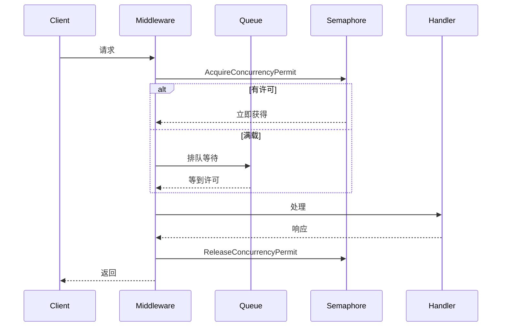

# pkg/api（内部视角）

🌐 `pkg/api/server.go` — HTTP API 实现细节。

`pkg/api` 用 gorilla/mux 提供 HTTP 服务，含并发限流、鉴权中间件、截图/批量/健康/统计端点。

> 📁 源码：[`pkg/api/server.go`](https://github.com/cyberspacesec/snir-skills/blob/main/pkg/api/server.go)

## 并发限流

| 符号 | 源码 | 说明 |
|------|------|------|
| `InitConcurrencyLimiter(max, queueSize)` | [L27](https://github.com/cyberspacesec/snir-skills/blob/main/pkg/api/server.go#L27) | 初始化信号量+队列 |
| `AcquireConcurrencyPermit(ctx)` | [L52](https://github.com/cyberspacesec/snir-skills/blob/main/pkg/api/server.go#L52) | 获取许可（可排队） |
| `ReleaseConcurrencyPermit()` | [L84](https://github.com/cyberspacesec/snir-skills/blob/main/pkg/api/server.go#L84) | 释放 |
| `GetConcurrencyStats()` | [L98](https://github.com/cyberspacesec/snir-skills/blob/main/pkg/api/server.go#L98) | 活跃/等待/上限/队列 |
| `CreateConcurrencyLimitMiddleware()` | [L110](https://github.com/cyberspacesec/snir-skills/blob/main/pkg/api/server.go#L110) | mux 中间件 |

## 端点

| 符号 | 源码 | 说明 |
|------|------|------|
| `HandleStats` | [L156](https://github.com/cyberspacesec/snir-skills/blob/main/pkg/api/server.go#L156) | `GET /stats` |
| `HandleHealth` | [L175](https://github.com/cyberspacesec/snir-skills/blob/main/pkg/api/server.go#L175) | `GET /health` |

## 并发模型

## 限流统计

[`GetConcurrencyStats`](https://github.com/cyberspacesec/snir-skills/blob/main/pkg/api/server.go#L98) 返回四元组：`active`（执行中）、`waiting`（排队）、`max`（上限）、`queue`（队列容量）+ `uptime`。`GET /stats` 暴露给监控。

## 中间件链

见 [API 概览](../api/overview)、[并发](../api/concurrency)、[鉴权](../api/auth)。

## 下一步

- [API 概览](../api/overview)
- [并发](../api/concurrency)
- [鉴权](../api/auth)
- [中间件](../api/middleware)
