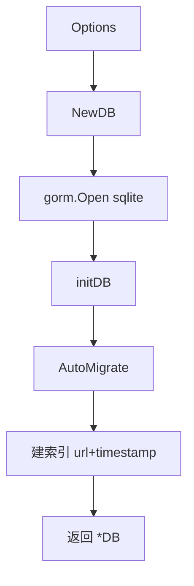
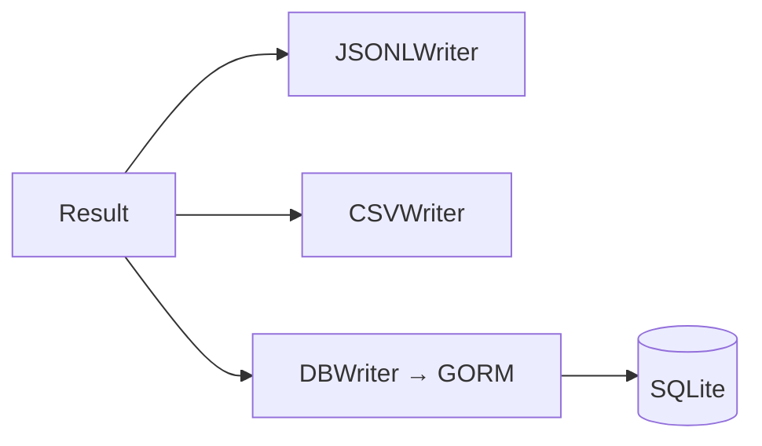

# pkg/database

🗄️ `pkg/database/database.go` — SQLite 持久化。

基于 GORM + SQLite，把 `Result` 存入数据库，支持查询、去重、历史追踪。

> 📁 源码：[`pkg/database/database.go`](https://github.com/cyberspacesec/snir-skills/blob/main/pkg/database/database.go)

## 核心类型

| 符号 | 源码 | 说明 |
|------|------|------|
| `Options` | [L17](https://github.com/cyberspacesec/snir-skills/blob/main/pkg/database/database.go#L17) | DB 配置 |
| `DB` | [L22](https://github.com/cyberspacesec/snir-skills/blob/main/pkg/database/database.go#L22) | DB 包装 |
| `NewDB(options)` | [L28](https://github.com/cyberspacesec/snir-skills/blob/main/pkg/database/database.go#L28) | 构造并迁移 |
| `initDB(gormDB)` | [L61](https://github.com/cyberspacesec/snir-skills/blob/main/pkg/database/database.go#L61) | 建表/索引 |

## 初始化流程

## Options 字段

::: tip 并发写多用 WAL 模式
| 字段 | 建议 | 理由 |
|------|------|------|
| `Path` | 持久化目录 | 容器记得挂卷 |
| `EnableWAL` | ✅ 生产开启 | WAL 模式读写不互锁，并发写入吞吐高很多 |
| `BusyTimeout` | 5-15s | 高并发下偶发锁竞争时等待而非立即报错 |

默认模式（rollback journal）写入时会全局锁表，批量采集并发写容易 `database is locked`，WAL 是解药。
:::

## 表结构

主要由 `models.Result` 映射，含：

- 主表 `results`：URL、状态、标题、时间戳、pHash、技术栈…
- 关联：cookies、console_logs、technologies（一对多）

ER 图见 [pkg/models](./models)。

## 与 Writer 的关系

`DBWriter` 实现 `runner.Writer` 接口，每条 `Result` 写入数据库，与 JSONL/CSV 并行：

## 查询应用

- 历史对比：同 URL 不同时间 pHash 距离
- 去重：相同 pHash 过滤
- 报告：从 DB 生成 HTML 报告

见 [数据库（进阶）](../advanced/database) 与 [CLI scan db](../cli/scan-db)。

## 下一步

- [pkg/models](./models)
- [Writer](./runner-writer)
- [数据库（进阶）](../advanced/database)
- [CLI scan db](../cli/scan-db)
