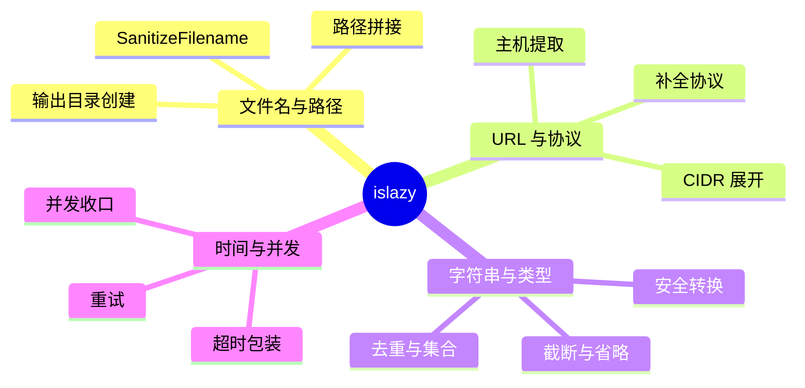

# pkg/islazy

<p align="center">🧰 `pkg/islazy/islazy.go` — 小工具集。</p>

零散但常用的辅助函数：目录创建、文件存在判断、切片包含、文件名净化等。

> 📁 源码：[`pkg/islazy/islazy.go`](https://github.com/cyberspacesec/snir-skills/blob/main/pkg/islazy/islazy.go)

## 函数

| 符号 | 源码 | 说明 |
|------|------|------|
| `CreateDir(path)` | [L15](https://github.com/cyberspacesec/snir-skills/blob/main/pkg/islazy/islazy.go#L15) | 递归建目录并返回路径 |
| `FileExists(filename)` | [L40](https://github.com/cyberspacesec/snir-skills/blob/main/pkg/islazy/islazy.go#L40) | 文件是否存在 |
| `DirExists(dirname)` | [L50](https://github.com/cyberspacesec/snir-skills/blob/main/pkg/islazy/islazy.go#L50) | 目录是否存在 |
| `SliceHasStr(slice, str)` | [L60](https://github.com/cyberspacesec/snir-skills/blob/main/pkg/islazy/islazy.go#L60) | 切片是否含字符串 |
| `SanitizeFilename(filename)` | [L75](https://github.com/cyberspacesec/snir-skills/blob/main/pkg/islazy/islazy.go#L75) | 净化文件名 |

## CreateDir

[`CreateDir`](https://github.com/cyberspacesec/snir-skills/blob/main/pkg/islazy/islazy.go#L15)：`MkdirAll` 后返回规范化路径，结果目录、证据目录创建都用它。

## SanitizeFilename

[`SanitizeFilename`](https://github.com/cyberspacesec/snir-skills/blob/main/pkg/islazy/islazy.go#L75)：把 URL/标题中的非法字符替换为 `_`，确保可作文件名：

```
  "https://example.com/a?b=2"  →  "https___example.com_a_b_2"
```

用于截图、HTML、HAR 等证据文件命名。


`pkg/islazy` 的工具函数按职责分类：



## 使用点

- `pkg/runner`：证据输出目录
- `pkg/report`：报告输出路径
- CLI：`--output` 目录创建

## 下一步

- [pkg/log](./log)
- [pkg/ascii](./ascii)
- [输出选项](../cli/scan-output)
