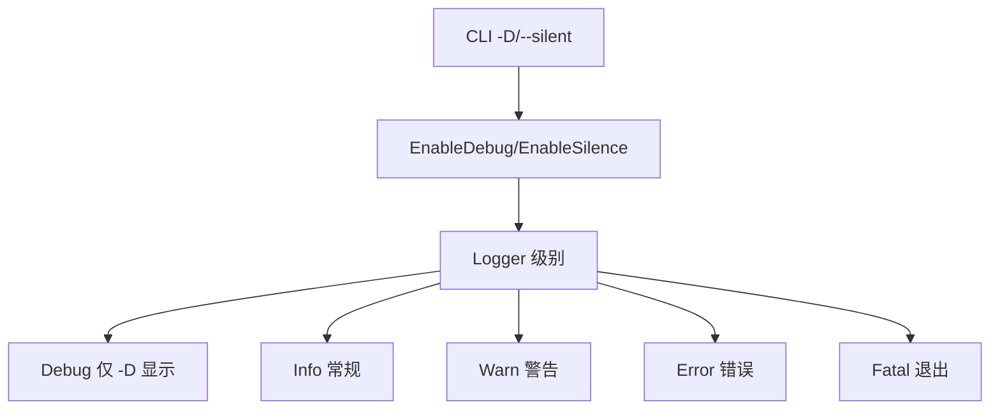

# pkg/log

📝 `pkg/log/log.go` — 统一日志门面。

封装 charmbracelet/log，提供分级彩色日志、命令标题、Markdown 渲染、调试开关。全项目统一调用，便于控制输出风格与级别。

> 📁 源码：[`pkg/log/log.go`](https://github.com/cyberspacesec/snir-skills/blob/main/pkg/log/log.go)

## 核心类型

| 符号 | 源码 | 说明 |
|------|------|------|
| `Logger` | [L47](https://github.com/cyberspacesec/snir-skills/blob/main/pkg/log/log.go#L47) | 内部 logger 状态 |
| `formatLogMessage` | [L76](https://github.com/cyberspacesec/snir-skills/blob/main/pkg/log/log.go#L76) | 统一格式化 |
| `GetLogger()` | [L222](https://github.com/cyberspacesec/snir-skills/blob/main/pkg/log/log.go#L222) | 取 `*slog.Logger` |
| `slogToCharm` | [L228](https://github.com/cyberspacesec/snir-skills/blob/main/pkg/log/log.go#L228) | slog→charm 适配 |

## 分级函数

| 函数 | 源码 | 级别 |
|------|------|------|
| `Debug` | [L119](https://github.com/cyberspacesec/snir-skills/blob/main/pkg/log/log.go#L119) | 🔍 调试 |
| `Info` | [L130](https://github.com/cyberspacesec/snir-skills/blob/main/pkg/log/log.go#L130) | ℹ️ 信息 |
| `Warn` | [L141](https://github.com/cyberspacesec/snir-skills/blob/main/pkg/log/log.go#L141) | ⚠️ 警告 |
| `Error` | [L152](https://github.com/cyberspacesec/snir-skills/blob/main/pkg/log/log.go#L152) | ❌ 错误 |
| `Fatal` | [L164](https://github.com/cyberspacesec/snir-skills/blob/main/pkg/log/log.go#L164) | 💀 致命（退出） |
| `Success` | [L176](https://github.com/cyberspacesec/snir-skills/blob/main/pkg/log/log.go#L176) | ✅ 成功 |

## 辅助

| 函数 | 源码 | 说明 |
|------|------|------|
| `CommandTitle(title)` | [L184](https://github.com/cyberspacesec/snir-skills/blob/main/pkg/log/log.go#L184) | 命令标题横幅 |
| `CommandHelp(text)` | [L195](https://github.com/cyberspacesec/snir-skills/blob/main/pkg/log/log.go#L195) | 帮助文本（Markdown 渲染） |
| `EnableDebug()` | [L201](https://github.com/cyberspacesec/snir-skills/blob/main/pkg/log/log.go#L201) | 开 Debug 级 |
| `EnableSilence()` | [L207](https://github.com/cyberspacesec/snir-skills/blob/main/pkg/log/log.go#L207) | 静默 |
| `IsDebugEnabled()` | [L214](https://github.com/cyberspacesec/snir-skills/blob/main/pkg/log/log.go#L214) | 查询开关 |

## 级别流

## slog 适配

`GetLogger` 返回标准库 `*slog.Logger`，通过 [`slogToCharm`](https://github.com/cyberspacesec/snir-skills/blob/main/pkg/log/log.go#L228) 桥接到 charm 输出，让用 slog 的库也能纳入统一风格。

## CommandHelp Markdown

[`CommandHelp`](https://github.com/cyberspacesec/snir-skills/blob/main/pkg/log/log.go#L195) 借助 glamour 把 Markdown 渲染成终端彩色文本，让 CLI 帮助更美观。

## 下一步

- [pkg/ascii](./ascii)
- [CLI 全局选项](../cli/global-options)
- [故障排查](../advanced/troubleshooting)
