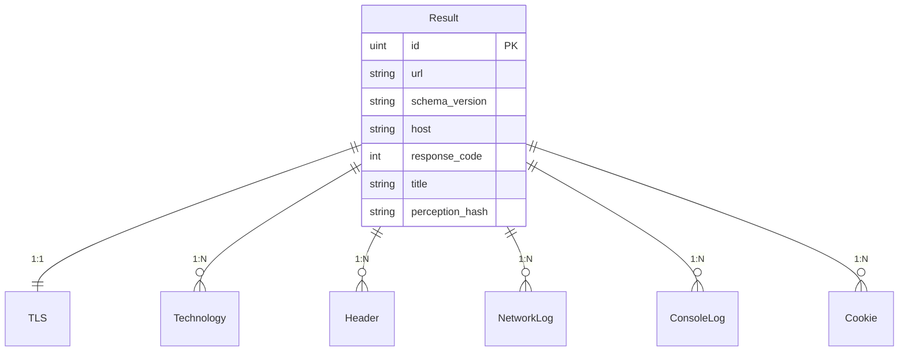
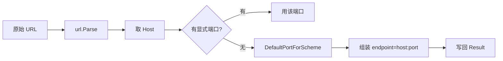

# pkg/models

<p align="center">📄 统一 Result 模型与证据结构。</p>

`pkg/models` 定义 snir 的核心数据模型，所有集成模式与 Writer 共享。

> 📁 源码：[`pkg/models/models.go`](https://github.com/cyberspacesec/snir-skills/blob/main/pkg/models/models.go) · [`pkg/models/time.go`](https://github.com/cyberspacesec/snir-skills/blob/main/pkg/models/time.go)

## 核心常量

[`ResultSchemaVersion`](https://github.com/cyberspacesec/snir-skills/blob/main/pkg/models/models.go#L11) = `"snir-skills.result.v1"`

每条结果带此字段，下游据此判断兼容性。

## 类型总览

| 类型 | 源码 | 说明 |
|------|------|------|
| `Result` | [L22](https://github.com/cyberspacesec/snir-skills/blob/main/pkg/models/models.go#L22) | 一次采集的顶层结果 |
| `RequestType` | [L14](https://github.com/cyberspacesec/snir-skills/blob/main/pkg/models/models.go#L14) | 请求类型（Request/Response） |
| `Header` | [L145](https://github.com/cyberspacesec/snir-skills/blob/main/pkg/models/models.go#L145) | HTTP 响应头 |
| `NetworkLog` | [L153](https://github.com/cyberspacesec/snir-skills/blob/main/pkg/models/models.go#L153) | 网络请求日志 |
| `ConsoleLog` | [L165](https://github.com/cyberspacesec/snir-skills/blob/main/pkg/models/models.go#L165) | 控制台日志 |
| `Cookie` | — | Cookie |
| `TLS` | — | TLS 证书信息 |
| `Technology` | — | 识别的技术 |

## Result 结构

`Result` 是核心聚合根，把截图与所有证据关联到一条记录：

```go
type Result struct {
    Path string `json:"path"`
    ID   uint   `json:"id" gorm:"primarykey"`

    URL           string    `json:"url"`
    SchemaVersion string    `json:"schema_version"`
    Scheme        string    `json:"scheme"`
    Host          string    `json:"host"`
    Port          int       `json:"port"`
    Endpoint      string    `json:"endpoint"`
    ProbedAt      time.Time `json:"probed_at"`
    FinalURL      string    `json:"final_url"`
    ResponseCode  int       `json:"response_code"`
    // ... 截图/哈希/失败标记 ...
    TLS          TLS          `json:"tls"`
    Technologies []Technology `json:"technologies"`
    Headers      []Header     `json:"headers"`
    Network      []NetworkLog `json:"network"`
    Console      []ConsoleLog `json:"console"`
    Cookies      []Cookie     `json:"cookies"`
}
```

完整字段见 [Result Schema](../reference/result-schema)。

## ER 关系



嵌套证据以切片挂载；GORM 持久化时各自成表，通过 `ResultID` 外键关联，`constraint:OnDelete:CASCADE`——删除 Result 时连带删除其证据。

## 辅助函数

| 函数 | 源码 | 说明 |
|------|------|------|
| `EnrichEndpoint(result)` | [L117](https://github.com/cyberspacesec/snir-skills/blob/main/pkg/models/models.go#L117) | 从 URL 补 host/port/scheme/endpoint |
| `DefaultPortForScheme(scheme)` | [L124](https://github.com/cyberspacesec/snir-skills/blob/main/pkg/models/models.go#L124) | http→80、https→443 |

`EnrichEndpoint` 的归一化逻辑：



## 时间

[`Now()`](https://github.com/cyberspacesec/snir-skills/blob/main/pkg/models/time.go)（`time.go`）集中时间获取，便于测试注入固定时间，避免直接 `time.Now()` 散落各处。

## 序列化约定

- JSONL：`ScreenshotBytes` 标 `json:"-"` 不序列化（字节不入文本）
- SQLite：`ScreenshotBytes` 标 `gorm:"-"` 不入库（字节不入库）
- 索引字段：`html`/`title`/`perception_hash`/`perception_hash_group_id` 标 `gorm:"index"`

## 下一步

- [Result Schema](../reference/result-schema)
- [字段字典](../reference/fields)
- [pkg/database](./database)
