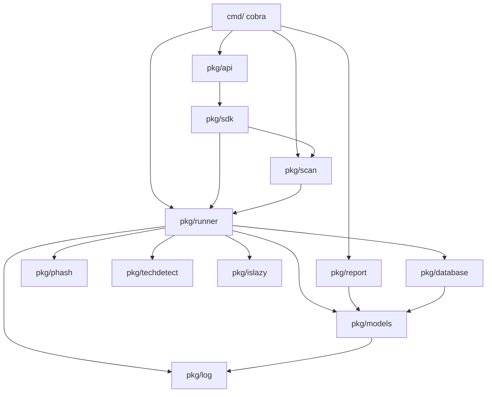
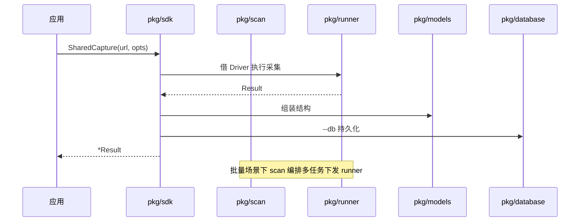

# 内部模块总览

<p align="center">🗺️ snir 内部代码架构全景。</p>

本文是各 `pkg/*` 模块的导航地图，每个模块都有独立详解页。

> 📁 源码目录：[`pkg/`](https://github.com/cyberspacesec/snir-skills/blob/main/pkg)

## 模块依赖



一次 SDK 调用穿越各层的典型时序：



## 模块速查

| 模块 | 源码 | 职责 | 详解 |
|------|------|------|------|
| `pkg/runner` | [runner/](https://github.com/cyberspacesec/snir-skills/blob/main/pkg/runner) | 浏览器驱动、池、截图、证据 | [→](./runner) |
| `pkg/scan` | [scan/](https://github.com/cyberspacesec/snir-skills/blob/main/pkg/scan) | 批量编排、目标展开 | [→](./scan) |
| `pkg/sdk` | [sdk/](https://github.com/cyberspacesec/snir-skills/blob/main/pkg/sdk) | Go SDK | [→](./sdk) |
| `pkg/api` | [api/](https://github.com/cyberspacesec/snir-skills/blob/main/pkg/api) | HTTP API | [→](./api) |
| `pkg/models` | [models/](https://github.com/cyberspacesec/snir-skills/blob/main/pkg/models) | 数据模型 | [→](./models) |
| `pkg/phash` | [phash/](https://github.com/cyberspacesec/snir-skills/blob/main/pkg/phash) | 感知哈希 | [→](./phash) |
| `pkg/techdetect` | [techdetect/](https://github.com/cyberspacesec/snir-skills/blob/main/pkg/techdetect) | 技术检测 | [→](./techdetect) |
| `pkg/database` | [database/](https://github.com/cyberspacesec/snir-skills/blob/main/pkg/database) | SQLite 持久化 | [→](./database) |
| `pkg/report` | [report/](https://github.com/cyberspacesec/snir-skills/blob/main/pkg/report) | 报告/转换/合并 | [→](./report) |
| `pkg/log` | [log/](https://github.com/cyberspacesec/snir-skills/blob/main/pkg/log) | 日志门面 | [→](./log) |
| `pkg/islazy` | [islazy/](https://github.com/cyberspacesec/snir-skills/blob/main/pkg/islazy) | 工具函数 | [→](./islazy) |
| `pkg/ascii` | [ascii/](https://github.com/cyberspacesec/snir-skills/blob/main/pkg/ascii) | 终端艺术 | [→](./ascii) |

## 分层

```
┌─────────────────────────────────────────┐
│  接入层：cmd(CLI) / pkg/api(HTTP)        │
├─────────────────────────────────────────┤
│  编排层：pkg/sdk / pkg/scan              │
├─────────────────────────────────────────┤
│  执行层：pkg/runner (Driver/Pool/Writer) │
├─────────────────────────────────────────┤
│  能力层：pkg/phash / pkg/techdetect      │
│         pkg/database / pkg/report        │
├─────────────────────────────────────────┤
│  基础层：pkg/models / pkg/log            │
│         pkg/islazy / pkg/ascii           │
└─────────────────────────────────────────┘
```

## 入口

- 用户视角：见 [架构](../guide/architecture) 与 [集成模式](../guide/integration-modes)
- 数据视角：见 [数据流](../guide/data-flow)

## 下一步

- [pkg/runner](./runner)
- [pkg/models](./models)
- [架构](../guide/architecture)
- [集成模式](../guide/integration-modes)
