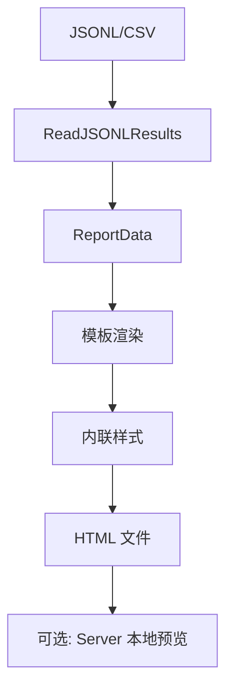

# pkg/report

📊 `pkg/report/` — 结果转换、HTML 报告、合并、本地预览。

把采集的 `Result`（JSONL/CSV/DB）转换为可读的 HTML 报告，支持格式互转、多结果合并、本地 HTTP 预览。

> 📁 源码目录：[`pkg/report/`](https://github.com/cyberspacesec/snir-skills/blob/main/pkg/report)

## 文件职责

| 文件 | 源码 | 职责 |
|------|------|------|
| `html.go` | [html.go](https://github.com/cyberspacesec/snir-skills/blob/main/pkg/report/html.go) | HTML 报告生成 |
| `convert.go` | [convert.go](https://github.com/cyberspacesec/snir-skills/blob/main/pkg/report/convert.go) | JSONL↔CSV 互转 |
| `merge.go` | [merge.go](https://github.com/cyberspacesec/snir-skills/blob/main/pkg/report/merge.go) | 多文件合并去重 |
| `server.go` | [server.go](https://github.com/cyberspacesec/snir-skills/blob/main/pkg/report/server.go) | 本地预览服务 |

## HTML 报告

| 符号 | 源码 | 说明 |
|------|------|------|
| `HTMLOptions` | [L19](https://github.com/cyberspacesec/snir-skills/blob/main/pkg/report/html.go#L19) | 报告选项 |
| `ReportData` | [L25](https://github.com/cyberspacesec/snir-skills/blob/main/pkg/report/html.go#L25) | 模板数据 |
| `ReportResult` | [L34](https://github.com/cyberspacesec/snir-skills/blob/main/pkg/report/html.go#L34) | 单条展示 |
| `GenerateHTML(options)` | [L354](https://github.com/cyberspacesec/snir-skills/blob/main/pkg/report/html.go#L354) | 生成 HTML |
| `getStatusClass(code)` | [L509](https://github.com/cyberspacesec/snir-skills/blob/main/pkg/report/html.go#L509) | 状态码着色 |
| `ReadJSONLResults(path)` | [L525](https://github.com/cyberspacesec/snir-skills/blob/main/pkg/report/html.go#L525) | 读 JSONL |

## Convert

| 符号 | 源码 | 说明 |
|------|------|------|
| `ConvertOptions` | [L20](https://github.com/cyberspacesec/snir-skills/blob/main/pkg/report/convert.go#L20) | 转换选项 |
| `Convert(options)` | [L29](https://github.com/cyberspacesec/snir-skills/blob/main/pkg/report/convert.go#L29) | 执行转换 |
| `readResults` / `writeResults` | [L83](https://github.com/cyberspacesec/snir-skills/blob/main/pkg/report/convert.go#L83) | 读写分发 |

## Merge

| 符号 | 源码 | 说明 |
|------|------|------|
| `MergeOptions` | [L15](https://github.com/cyberspacesec/snir-skills/blob/main/pkg/report/merge.go#L15) | 合并选项 |
| `Merge(options)` | [L22](https://github.com/cyberspacesec/snir-skills/blob/main/pkg/report/merge.go#L22) | 执行合并 |
| `findSourceFiles(dir)` | [L91](https://github.com/cyberspacesec/snir-skills/blob/main/pkg/report/merge.go#L91) | 扫描目录 |
| `deduplicateResults(results)` | [L118](https://github.com/cyberspacesec/snir-skills/blob/main/pkg/report/merge.go#L118) | 去重 |

## Server

| 符号 | 源码 | 说明 |
|------|------|------|
| `ServerOptions` | [L15](https://github.com/cyberspacesec/snir-skills/blob/main/pkg/report/server.go#L15) | 服务选项 |
| `Server` | [L23](https://github.com/cyberspacesec/snir-skills/blob/main/pkg/report/server.go#L23) | 预览服务 |
| `NewServer(options)` | [L28](https://github.com/cyberspacesec/snir-skills/blob/main/pkg/report/server.go#L28) | 构造 |

## 报告生成流程

## 状态着色

[`getStatusClass`](https://github.com/cyberspacesec/snir-skills/blob/main/pkg/report/html.go#L509) 按状态码分色：2xx 绿、3xx 蓝、4xx 黄、5xx 红，报告一目了然。

见 [报告（进阶）](../advanced/reports) 与 [CLI report](../cli/report)。

## 下一步

- [报告（进阶）](../advanced/reports)
- [CLI report](../cli/report)
- [CLI report html](../cli/report-html)
- [pkg/models](./models)
