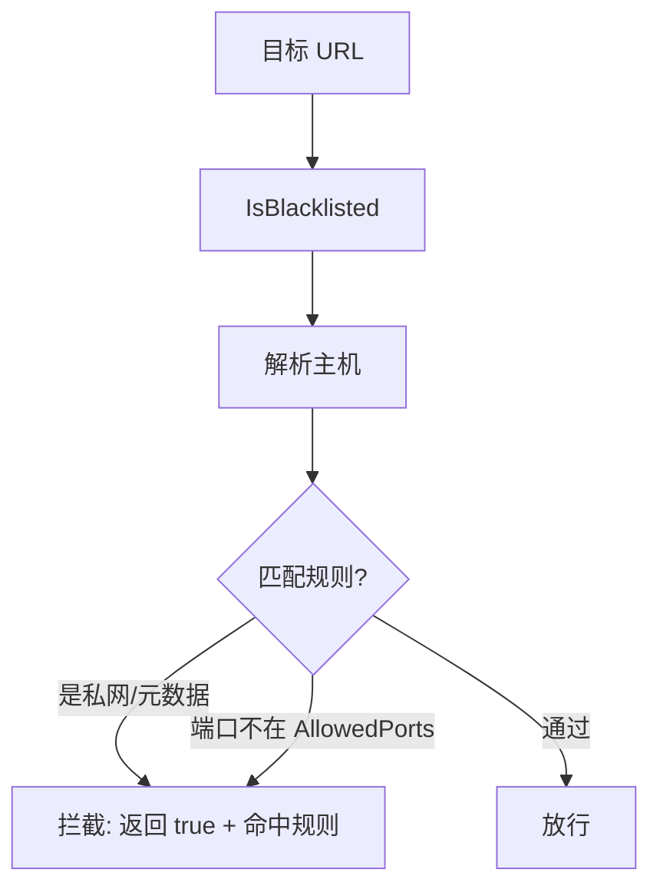
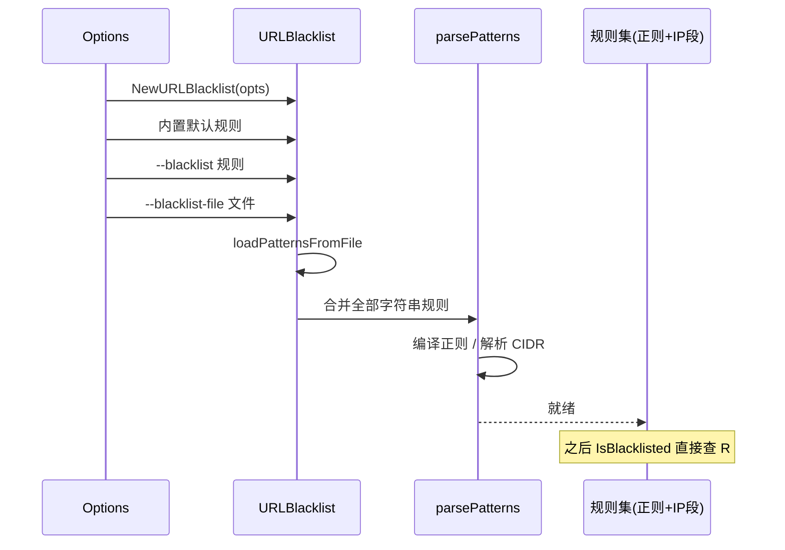

# Blacklist

🚫 `pkg/runner/blacklist.go` — SSRF 防护与目标过滤。

`URLBlacklist` 在请求前拦截危险/越权目标，是 snir 的安全基石。默认开启，屏蔽内网与云元数据。

> 📁 源码：[`pkg/runner/blacklist.go`](https://github.com/cyberspacesec/snir-skills/blob/main/pkg/runner/blacklist.go)

## 核心类型

| 符号 | 源码 | 说明 |
|------|------|------|
| `URLBlacklist` | [L51](https://github.com/cyberspacesec/snir-skills/blob/main/pkg/runner/blacklist.go#L51) | 黑名单主体 |
| `NewURLBlacklist(opts)` | [L60](https://github.com/cyberspacesec/snir-skills/blob/main/pkg/runner/blacklist.go#L60) | 构造 |
| `loadPatternsFromFile(path)` | [L103](https://github.com/cyberspacesec/snir-skills/blob/main/pkg/runner/blacklist.go#L103) | 从文件加载规则 |
| `(*URLBlacklist) parsePatterns()` | [L129](https://github.com/cyberspacesec/snir-skills/blob/main/pkg/runner/blacklist.go#L129) | 编译正则 |
| `(*URLBlacklist) IsBlacklisted(url)` | [L176](https://github.com/cyberspacesec/snir-skills/blob/main/pkg/runner/blacklist.go#L176) | 判定 |

## 拦截流程

## 默认规则

| 类别 | 示例 |
|------|------|
| 私有网段 | `10.0.0.0/8`、`172.16.0.0/12`、`192.168.0.0/16`、`fc00::/7` |
| 回环 | `127.0.0.0/8`、`::1` |
| 链路本地 | `169.254.0.0/16` |
| 云元数据 | `169.254.169.254`、`metadata.google.internal` |
| 受限端口 | 数据库端口 1433/3306/5432/6379 等 |

::: warning
生产环境务必保留默认黑名单。仅在授权内网扫描时才 `--enable-blacklist=false`。
:::

## parsePatterns

[`parsePatterns`](https://github.com/cyberspacesec/snir-skills/blob/main/pkg/runner/blacklist.go#L129) 把字符串规则编译为正则/IP 段，支持主机名通配与 CIDR。

规则从配置到可判定结构的加载编译时序：

## 配置

- `Options.BlacklistEnabled`：总开关
- `Options.Blacklist`：自定义规则
- `Options.BlacklistFile`：规则文件
- `Options.AllowedPorts`：端口白名单

见 [黑名单（进阶）](../advanced/blacklist) 与 [CLI scan blacklist](../cli/scan-blacklist)。

## 下一步

- [黑名单（进阶）](../advanced/blacklist)
- [CLI scan blacklist](../cli/scan-blacklist)
- [安全](../advanced/security)
- [Options](./runner-options)
