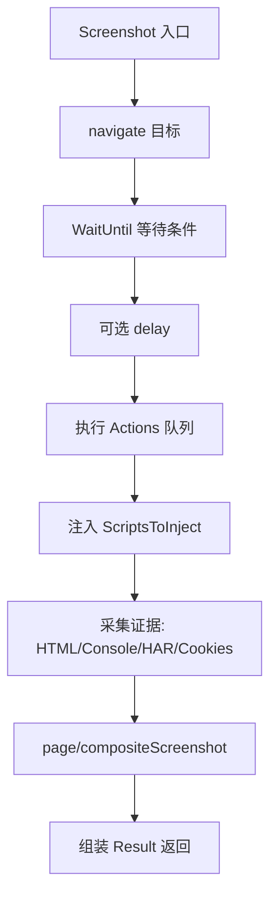
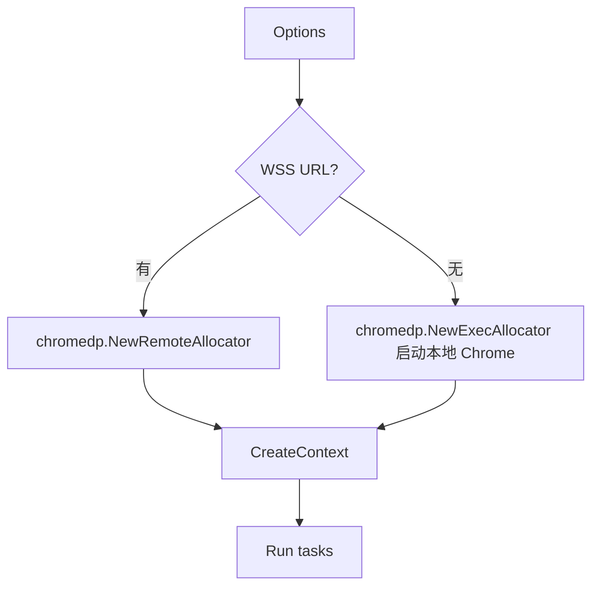

# Chromedp Driver

🌐 `pkg/runner/driver_chromedp.go` — 基于 chromedp/cdproto 的 CDP 实现。

`chromedpDriver` 实现 `Driver` 接口，用 chromedp 驱动本地或远程 Chrome，执行截图、JS、证据采集等所有 CDP 操作。

> 📁 源码：[`pkg/runner/driver_chromedp.go`](https://github.com/cyberspacesec/snir-skills/blob/main/pkg/runner/driver_chromedp.go)

## 核心类型

| 符号 | 源码 | 说明 |
|------|------|------|
| `chromedpDriver` | [L22](https://github.com/cyberspacesec/snir-skills/blob/main/pkg/runner/driver_chromedp.go#L22) | Driver 实现 |
| `newChromedpDriver(opts)` | [L67](https://github.com/cyberspacesec/snir-skills/blob/main/pkg/runner/driver_chromedp.go#L67) | 构造（内部） |
| `(*chromedpDriver) Screenshot` | [L110](https://github.com/cyberspacesec/snir-skills/blob/main/pkg/runner/driver_chromedp.go#L110) | 主截图入口 |
| `(*chromedpDriver) Close` | [L320](https://github.com/cyberspacesec/snir-skills/blob/main/pkg/runner/driver_chromedp.go#L320) | 关闭释放 |

## Screenshot 内部阶段

[`Screenshot`](https://github.com/cyberspacesec/snir-skills/blob/main/pkg/runner/driver_chromedp.go#L110) 是最核心的方法，分阶段执行 CDP 命令：

## CDP 域使用

| CDP 域 | 用途 |
|--------|------|
| `Page` | navigate、screenshot、FrameTree |
| `Network` | ExtraHeaders、HAR、cookies |
| `Runtime` | evaluate、console API、exception |
| `Emulation` | viewport、device、locale、timezone |
| `Security` | ignoreCertErrors |
| `Fetch`/`Fetch.enable` | 拦截请求 |

## 远程 vs 本地

远程 Chrome 见 [`--wss`](../cli/scan-chrome)。

## 证据采集

证据采集分布在 Screenshot 各阶段，受 `Options` 中对应开关控制：

| 开关 | 采集内容 |
|------|---------|
| `Screenshot` | PNG（full page 或 viewport） |
| `HTML` | `Page.getResourceContent`/DOM |
| `ConsoleLogs` | `Runtime.consoleAPICalled` |
| `HAR` | Network 事件归档 |
| `Cookies` | `Network.getAllCookies` |

## 与 Driver 接口

`chromedpDriver` 满足 [`Driver`](./runner-driver) 接口，因此可被 `DriverPool`/`PoolDriver` 复用，与 `Runner` 解耦。

## 下一步

- [Driver 接口](./runner-driver)
- [Runner 核心](./runner-core)
- [证据（进阶）](../advanced/evidence)
- [远程 Chrome](../advanced/remote-chrome)
