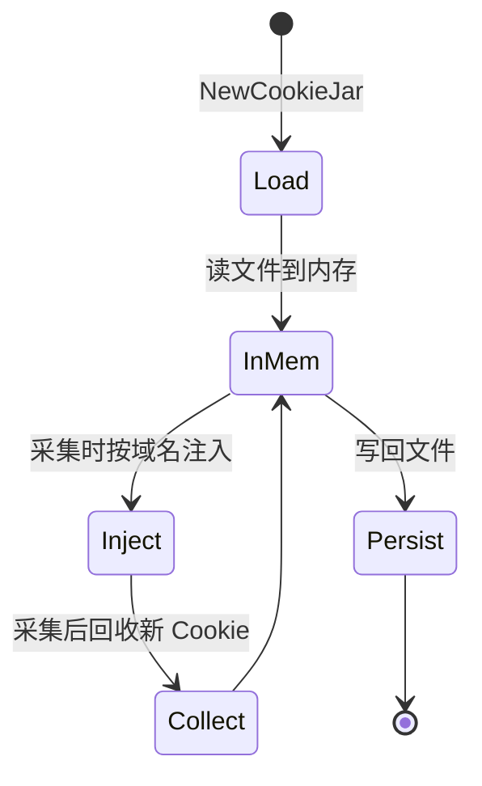
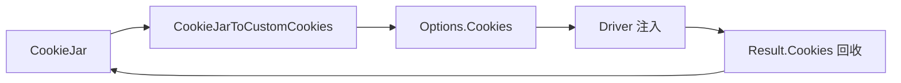

# CookieJar

🍪 `pkg/runner/cookie_jar.go` — 持久化 Cookie 容器。

`CookieJar` 管理 snir 采集的 Cookie：跨目标复用、持久化到文件、按域名匹配注入。支持登录态保持、会话跟踪。

> 📁 源码：[`pkg/runner/cookie_jar.go`](https://github.com/cyberspacesec/snir-skills/blob/main/pkg/runner/cookie_jar.go)

## 核心类型

| 符号 | 源码 | 说明 |
|------|------|------|
| `CookieJar` | [L18](https://github.com/cyberspacesec/snir-skills/blob/main/pkg/runner/cookie_jar.go#L18) | Jar 主体 |
| `PersistentCookie` | [L25](https://github.com/cyberspacesec/snir-skills/blob/main/pkg/runner/cookie_jar.go#L25) | 持久化 Cookie |
| `NewCookieJar(filePath)` | [L62](https://github.com/cyberspacesec/snir-skills/blob/main/pkg/runner/cookie_jar.go#L62) | 构造（关联文件） |
| `CookieJarToCustomCookies(jar, domain)` | [L343](https://github.com/cyberspacesec/snir-skills/blob/main/pkg/runner/cookie_jar.go#L343) | 按域名导出为注入用 |
| `domainMatches(req, cookie)` | [L355](https://github.com/cyberspacesec/snir-skills/blob/main/pkg/runner/cookie_jar.go#L355) | 域名匹配判定 |

## 生命周期

## 域名匹配

[`domainMatches`](https://github.com/cyberspacesec/snir-skills/blob/main/pkg/runner/cookie_jar.go#L355) 实现 RFC 6265 域名匹配规则：domain cookie 适用于子域，host-only cookie 仅限精确域名。决定哪些 Cookie 注入到给定目标。

## 与采集衔接

## PersistentCookie 字段

| 字段 | 说明 |
|------|------|
| `Name/Value` | Cookie 键值 |
| `Domain` | 适用域 |
| `Path` | 路径 |
| `Expires` | 过期时间 |
| `Secure/HttpOnly` | 属性 |
| `Source` | 来源（手动/Netscape/采集） |

## 持久化格式

默认 JSON 文件，跨进程复用。Netscape 格式见 [Netscape Cookie](./runner-cookie-netscape)。

## 下一步

- [Netscape Cookie](./runner-cookie-netscape)
- [Cookie 工具](./runner-cookie-util)
- [Cookie（进阶）](../advanced/cookie)
- [CLI scan cookie](../cli/scan-cookie)
