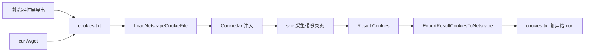
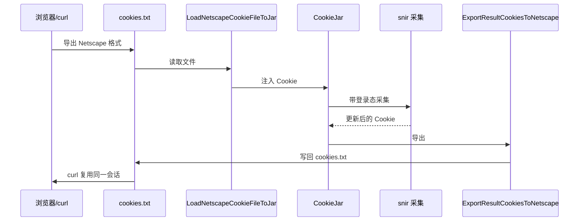

# Netscape Cookie

<p align="center">📜 `pkg/runner/cookie_netscape.go` — Netscape cookies.txt 互操作。</p>

支持读写 Netscape `cookies.txt` 格式，与 curl、wget、浏览器扩展导出互通，便于复用已有登录态。

> 📁 源码：[`pkg/runner/cookie_netscape.go`](https://github.com/cyberspacesec/snir-skills/blob/main/pkg/runner/cookie_netscape.go)

## 函数

| 符号 | 源码 | 说明 |
|------|------|------|
| `LoadNetscapeCookieFile(path)` | [L31](https://github.com/cyberspacesec/snir-skills/blob/main/pkg/runner/cookie_netscape.go#L31) | 加载为 `[]CustomCookie` |
| `LoadNetscapeCookieFileToJar(path, persistent, source)` | [L107](https://github.com/cyberspacesec/snir-skills/blob/main/pkg/runner/cookie_netscape.go#L107) | 加载到 `CookieJar` |
| `SaveNetscapeCookieFile(path, cookies)` | [L191](https://github.com/cyberspacesec/snir-skills/blob/main/pkg/runner/cookie_netscape.go#L191) | 保存为 cookies.txt |
| `ExportResultCookiesToNetscape(path, resultCookies, url)` | [L244](https://github.com/cyberspacesec/snir-skills/blob/main/pkg/runner/cookie_netscape.go#L244) | 把采集结果导出 |

## 格式

每行 7 字段（Tab 分隔），`#` 开头为注释/`HttpOnly` 标记：

```
# Netscape HTTP Cookie File
.example.com    TRUE    /    FALSE    1735689600    session_id    abc123
.example.com    TRUE    /    TRUE     1735689600    token         xyz
```

| 列 | 含义 |
|----|------|
| 1 | domain |
| 2 | include subdomains (TRUE/FALSE) |
| 3 | path |
| 4 | secure (TRUE/FALSE) |
| 5 | expiry (Unix 秒) |
| 6 | name |
| 7 | value |

## 互通



Cookie 在 Netscape 格式与 snir 间的往返时序：



## LoadNetscapeCookieFileToJar

[`LoadNetscapeCookieFileToJar`](https://github.com/cyberspacesec/snir-skills/blob/main/pkg/runner/cookie_netscape.go#L107)：一步加载文件到 `CookieJar`，`persistent` 决定是否写回，`source` 标记来源便于审计。

## 下一步

- [CookieJar](./runner-cookie-jar)
- [Cookie 工具](./runner-cookie-util)
- [Cookie（进阶）](../advanced/cookie)
- [CLI scan cookie](../cli/scan-cookie)
