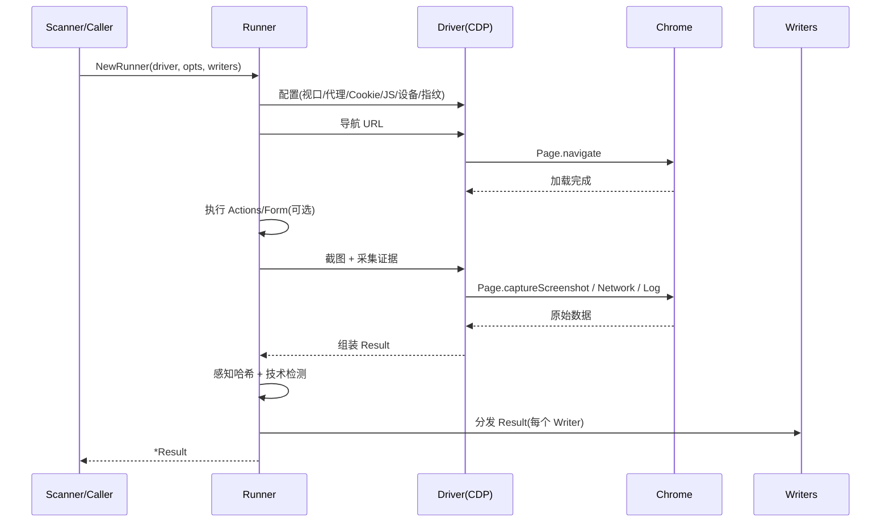
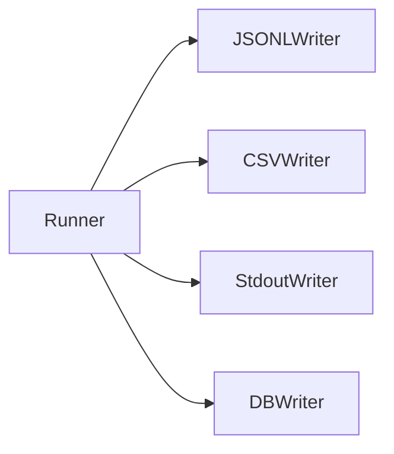

# Runner 核心

<p align="center">🏃 `pkg/runner/runner.go` — 执行器。</p>

`Runner` 是单次截图执行的核心，协调 Driver 与 Writer。

> 📁 源码：[`pkg/runner/runner.go`](https://github.com/cyberspacesec/snir-skills/blob/main/pkg/runner/runner.go)

## 类型

### Runner

[`Runner`](https://github.com/cyberspacesec/snir-skills/blob/main/pkg/runner/runner.go#L18) 持有一个 `Driver` 和一组 `Writer`，是单次执行的编排者。

### Writer 接口

[`Writer`](https://github.com/cyberspacesec/snir-skills/blob/main/pkg/runner/runner.go#L48) 抽象 `Result` 的持久化：

```go
type Writer interface {
    // 把 Result 写到对应目的地
}
```

实现见 [Writer](./runner-writer)。

## 构造

[`NewRunner`](https://github.com/cyberspacesec/snir-skills/blob/main/pkg/runner/runner.go#L55)：

```go
func NewRunner(logger *slog.Logger, driver Driver, opts Options, writers []Writer) (*Runner, error)
```

参数：

- `logger`：结构化日志器
- `driver`：浏览器驱动（通常是 `ChromeDP`）
- `opts`：截图配置
- `writers`：持久化 Writer 列表（可多个）

## 执行流程



## Runner 内部职责

```
┌──────────────────────── Runner ────────────────────────┐
│  Options ──► 配置 Driver（视口/UA/代理/Cookie/JS/指纹）  │
│                                                          │
│  Driver ──► 导航 ► 交互 ► 截图 ► 采集证据                │
│                                                          │
│  组装 Result：                                           │
│    ├─ URL/FinalURL/ResponseCode/Title                    │
│    ├─ HTML/Headers/Cookies/Console/Network/TLS           │
│    ├─ Technologies  (techdetect)                         │
│    ├─ PerceptionHash (phash)                             │
│    └─ SchemaVersion                                      │
│                                                          │
│  分发 Result ──► [JSONLWriter, CSVWriter, StdoutWriter, DBWriter]
└──────────────────────────────────────────────────────────┘
```

## 多 Writer 分发

`Runner` 不直接写文件，而是把 `Result` 分发给注入的 `[]Writer`。这让输出格式可插拔：



## 与 DriverPool 的关系

`Runner` 本身持单 `Driver`；并发复用由 `DriverPool`/`PoolDriver`/共享池单例在更上层处理。`Runner` 关注"一次执行"，池关注"复用"。

## 下一步

- [Driver 接口](./runner-driver)
- [Writer](./runner-writer)
- [Options](./runner-options)
- [ChromeDP 实现](./runner-chromedp)
