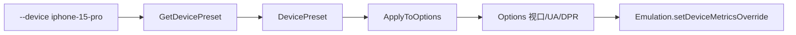

# Device Presets

📱 `pkg/runner/device_presets.go` — 移动设备视口与指纹预设。

内置常见手机/平板预设，一键模拟设备视口、UA、缩放等，省去手动配置。

> 📁 源码：[`pkg/runner/device_presets.go`](https://github.com/cyberspacesec/snir-skills/blob/main/pkg/runner/device_presets.go)

## 核心类型

| 符号 | 源码 | 说明 |
|------|------|------|
| `DevicePreset` | [L10](https://github.com/cyberspacesec/snir-skills/blob/main/pkg/runner/device_presets.go#L10) | 设备预设 |
| `devicePresets` | [L21](https://github.com/cyberspacesec/snir-skills/blob/main/pkg/runner/device_presets.go#L21) | 内置预设表 |
| `GetDevicePreset(name)` | [L178](https://github.com/cyberspacesec/snir-skills/blob/main/pkg/runner/device_presets.go#L178) | 按名取（大小写不敏感） |
| `ListDevicePresets()` | [L195](https://github.com/cyberspacesec/snir-skills/blob/main/pkg/runner/device_presets.go#L195) | 列出全部 |
| `(*DevicePreset) ApplyToOptions(opts)` | [L211](https://github.com/cyberspacesec/snir-skills/blob/main/pkg/runner/device_presets.go#L211) | 应用到 Options |

## DevicePreset 字段

| 字段 | 说明 |
|------|------|
| `Name` | 标识符（`iphone-15-pro`） |
| `DisplayName` | 显示名（`iPhone 15 Pro`） |
| `Width/Height` | 视口像素 |
| `DeviceScaleFactor` | DPR |
| `UserAgent` | UA 字符串 |
| `Mobile` | 是否移动端 |
| `Touch` | 是否触摸 |

## 应用流程

## 匹配

[`GetDevicePreset`](https://github.com/cyberspacesec/snir-skills/blob/main/pkg/runner/device_presets.go#L178) 大小写不敏感，且支持按 `Name` 或 `DisplayName` 匹配，故 `iPhone-15-Pro` 与 `Pixel 8 Pro` 都能命中。

## 内置设备

涵盖主流 iPhone、Pixel、Galaxy、iPad 等。`ListDevicePresets()` 可枚举，CLI `scan device --list` 展示。

见 [设备模拟（进阶）](../advanced/device) 与 [CLI scan device](../cli/scan-device)。

## 下一步

- [设备模拟（进阶）](../advanced/device)
- [CLI scan device](../cli/scan-device)
- [指纹（进阶）](../advanced/fingerprint)
- [Options](./runner-options)
