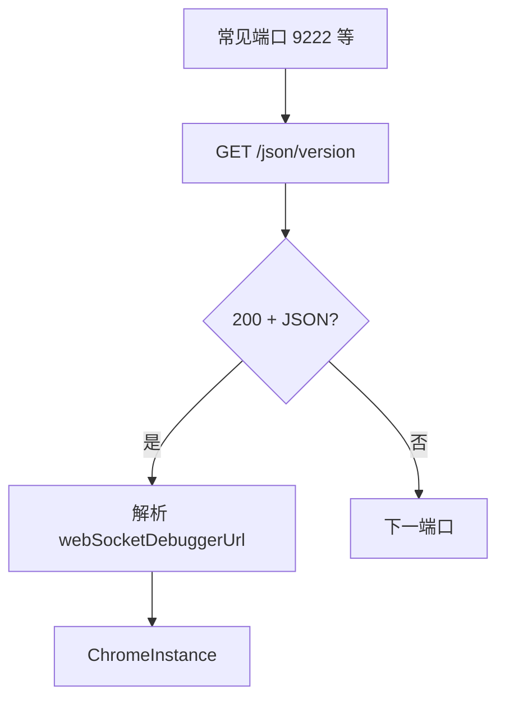

# Discovery

🔭 `pkg/runner/discovery.go` — 自动发现可用的 Chrome。

`discovery` 探测本地或指定主机上已运行的 Chrome 远程调试端口，无需手动指定 `--wss`，实现 `AutoConnect`。

> 📁 源码：[`pkg/runner/discovery.go`](https://github.com/cyberspacesec/snir-skills/blob/main/pkg/runner/discovery.go)

## 核心类型

| 符号 | 源码 | 说明 |
|------|------|------|
| `ChromeInstance` | [L13](https://github.com/cyberspacesec/snir-skills/blob/main/pkg/runner/discovery.go#L13) | 发现的实例信息 |
| `DiscoverChrome(host, ports)` | [L23](https://github.com/cyberspacesec/snir-skills/blob/main/pkg/runner/discovery.go#L23) | 探测 |
| `DiscoverChromeWithTimeout(host, ports, timeout)` | [L43](https://github.com/cyberspacesec/snir-skills/blob/main/pkg/runner/discovery.go#L43) | 带超时探测 |
| `probeChromePort(host, port)` | [L65](https://github.com/cyberspacesec/snir-skills/blob/main/pkg/runner/discovery.go#L65) | 探测单端口 |
| `probeChromePortWithClient(host, port, client)` | [L71](https://github.com/cyberspacesec/snir-skills/blob/main/pkg/runner/discovery.go#L71) | 用指定 HTTP client 探测 |
| `AutoConnect(opts, maxConcurrent)` | [L106](https://github.com/cyberspacesec/snir-skills/blob/main/pkg/runner/discovery.go#L106) | 发现+建池一步到位 |

## 发现原理

Chrome 远程调试暴露 HTTP 端点 `/json/version` 返回 JSON：

## AutoConnect

[`AutoConnect`](https://github.com/cyberspacesec/snir-skills/blob/main/pkg/runner/discovery.go#L106)：发现可用 Chrome 后直接构造 `DriverPool`，供共享池/SDK 使用。

## ChromeInstance 字段

| 字段 | 说明 |
|------|------|
| `Host` | 主机 |
| `Port` | 端口 |
| `WSEndpoint` | WebSocket 调试 URL |
| `Version` | Chrome 版本 |

## 安全

::: danger 远程调试端口绝不暴露公网
Chrome 的 `--remote-debugging-port` 一旦可达，任何人都能通过 `/json/version` 拿到 WebSocket 端点，**完全控制该 Chrome 实例**（可任意导航、执行 JS、读页面数据）。

- ✅ 仅探测**授权范围内**的主机
- ✅ 远程调试端口只在内网/容器网络开放，前置鉴权或 SSH 隧道
- ❌ 切勿把 `:9222` 直接映射到公网
:::

## 下一步

- [DriverPool](./runner-pool)
- [远程 Chrome](../advanced/remote-chrome)
- [CLI scan chrome](../cli/scan-chrome)
- [SDK 自动连接](../sdk/autoconnect)
