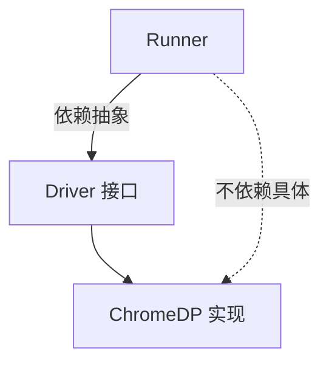
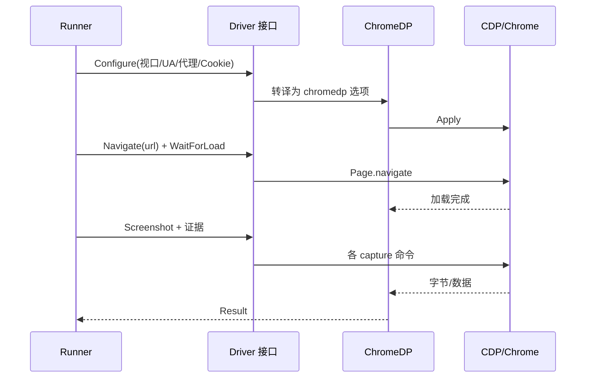

# Driver 接口

<p align="center">🔌 `pkg/runner/driver.go` — 浏览器驱动抽象。</p>

`Driver` 是浏览器交互的抽象接口，解耦执行逻辑与具体浏览器实现。

> 📁 源码：[`pkg/runner/driver.go`](https://github.com/cyberspacesec/snir-skills/blob/main/pkg/runner/driver.go)

## ChromeNotFoundError

[`ChromeNotFoundError`](https://github.com/cyberspacesec/snir-skills/blob/main/pkg/runner/driver.go#L10) 找不到 Chrome 时返回，提示安装或指定 `--chrome-path`。

## Driver 接口

[`Driver`](https://github.com/cyberspacesec/snir-skills/blob/main/pkg/runner/driver.go#L19) 是浏览器驱动抽象：

```go
type Driver interface {
    // 截图与证据采集的统一接口
}
```

`ChromeDP` 是其主要实现（基于 chromedp/cdproto）。

## 设计意图



接口抽象让未来可扩展其他浏览器后端（如 Firefox/Playwright），而 `Runner` 逻辑不变——符合依赖倒置原则。

一次采集在 Runner 与 Driver 间的调用时序：



## 抽象层次

```
         ┌─────────────┐
         │   Runner    │  ← 编排，只认 Driver 接口
         └──────┬──────┘
                │ depends on
         ┌──────▼──────┐
         │ Driver iface│  ← 抽象契约
         └──────┬──────┘
        ┌───────┼───────┐
        │       │       │
   ┌────▼──┐ ┌─▼─┐  ┌──▼──┐
   │ChromeDP│ │...│  │未来│  ← 具体实现可插拔
   └───────┘ └───┘  └─────┘
```

## 与 Runner 的协作

`Runner` 通过 `Driver` 完成所有浏览器操作：

| Runner 职责 | Driver 职责 |
|-------------|------------|
| 解析 Options | 配置视口/UA/代理/Cookie |
| 编排交互顺序 | 执行导航/点击/输入 |
| 组装 Result | 截图+采集原始证据 |
| 分发 Writer | — |

## 下一步

- [ChromeDP 实现](./runner-chromedp)
- [Runner 核心](./runner-core)
- [故障排查](../advanced/troubleshooting)
