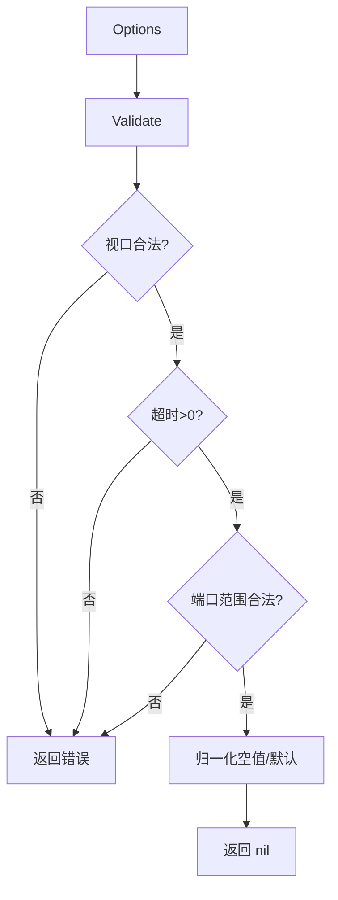
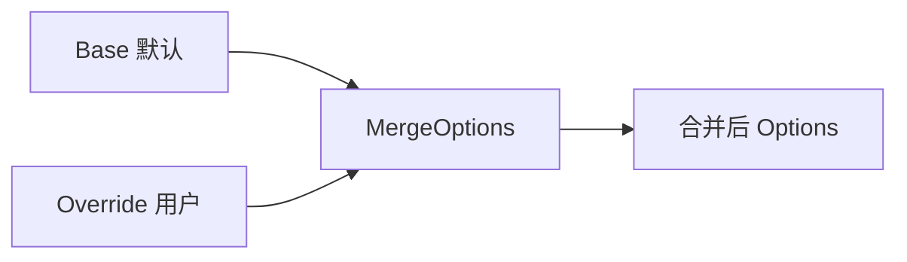
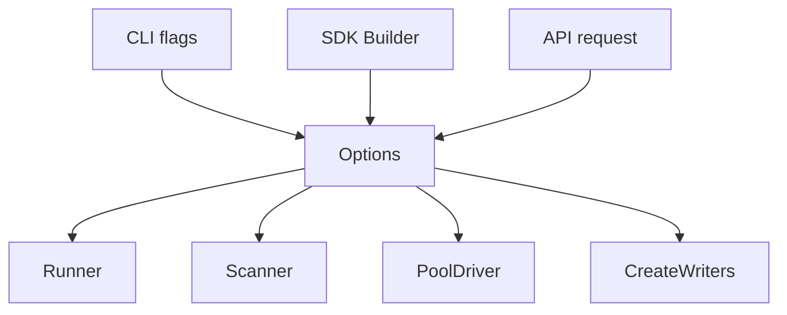

# Options

<p align="center">⚙️ `pkg/runner/options.go` — 采集选项容器。</p>

`Options` 是 snir 的核心配置载体，承载截图、网络、证据、安全等全部可调参数，被 `Runner`/`Scanner`/`PoolDriver` 与 SDK 构造器共用。

> 📁 源码：[`pkg/runner/options.go`](https://github.com/cyberspacesec/snir-skills/blob/main/pkg/runner/options.go)

## 核心类型

| 符号 | 源码 | 说明 |
|------|------|------|
| `Options` | [L18](https://github.com/cyberspacesec/snir-skills/blob/main/pkg/runner/options.go#L18) | 选项主结构 |
| `NewOptions()` | [L43](https://github.com/cyberspacesec/snir-skills/blob/main/pkg/runner/options.go#L43) | 带安全默认值的构造 |
| `DefaultOptions` | [L50](https://github.com/cyberspacesec/snir-skills/blob/main/pkg/runner/options.go#L50) | 默认实例 |
| `Validate()` | [L62](https://github.com/cyberspacesec/snir-skills/blob/main/pkg/runner/options.go#L62) | 校验与归一化 |
| `MergeOptions(base, override)` | [L131](https://github.com/cyberspacesec/snir-skills/blob/main/pkg/runner/options.go#L131) | 合并两份选项 |

## 字段分组

```
Options
├── 视图：ViewportWidth/Height/DeviceScaleFactor/FullPage
├── 网页：WaitUntil/Timeout/Delay/LoadTimeout
├── 证据：Screenshot/HTML/ConsoleLogs/HAR/Cookies/ScreenshotFullPage
├── 网络：Proxy/ProxyBypass/ExtraHeaders/UserAgent
├── 指纹：Locale/Timezone/Geolocation/WebRTC/Canvas
├── JS：  ScriptsToInject/Actions[]
├── 安全：BlacklistEnabled/Blacklist/AllowedPorts
└── 输出：Writer(JSONL/CSV/Stdout)/OutputPath
```

## NewOptions 安全默认

[`NewOptions`](https://github.com/cyberspacesec/snir-skills/blob/main/pkg/runner/options.go#L43) 与 [`DefaultOptions`](https://github.com/cyberspacesec/snir-skills/blob/main/pkg/runner/options.go#L50) 默认开启黑名单、设置合理超时与视口，确保开箱即安全。

## Validate 流程



## MergeOptions 语义

::: warning 注意"零值"陷阱
[`MergeOptions`](https://github.com/cyberspacesec/snir-skills/blob/main/pkg/runner/options.go#L131)：以 `base` 为底，`override` 中**非零字段**覆盖，**零值字段保留 base**。

这意味着你**无法用 override 把某字段显式设为"零值/关闭"**——例如想用 override 把 `Timeout` 改回 0（不限时），MergeOptions 会认为 0 是零值而保留 base 的值。这类需求得直接改 base 或用专门的禁用开关。
:::



## 与其他组件的关系



## 下一步

- [Runner 核心](./runner-core)
- [SDK 构建器](../sdk/builders)
- [CLI 全局选项](../cli/global-options)
- [输出选项](../cli/scan-output)
