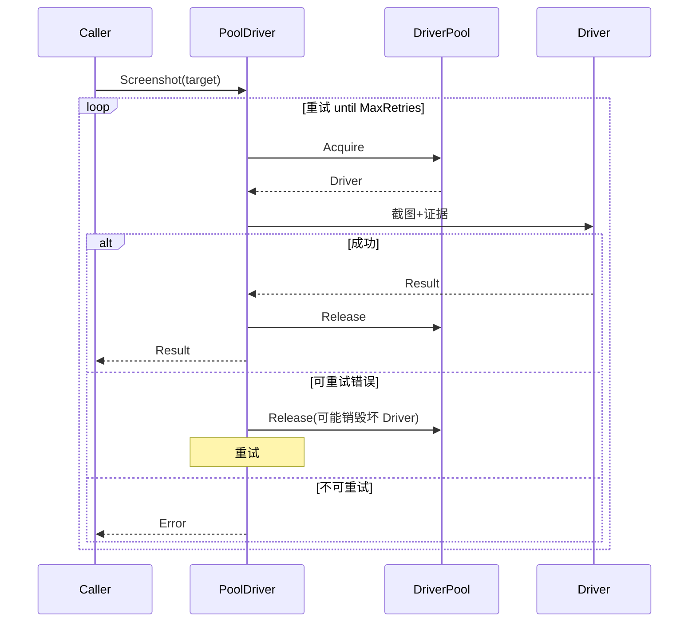
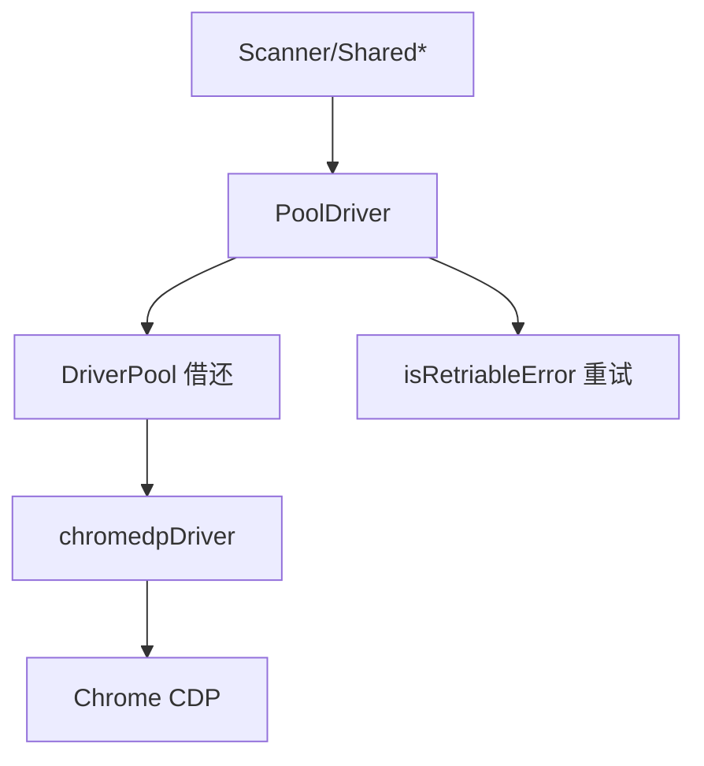

# PoolDriver

🔌 `pkg/runner/pool_driver.go` — 池化截图执行器。

`PoolDriver` 在 `DriverPool` 之上提供"借一个 Driver→截图→归还"的高层接口，是 `NewPooledScanner` 与共享池 `SharedScreenshot` 的执行核心。

> 📁 源码：[`pkg/runner/pool_driver.go`](https://github.com/cyberspacesec/snir-skills/blob/main/pkg/runner/pool_driver.go)

## 核心类型

| 符号 | 源码 | 说明 |
|------|------|------|
| `PoolDriver` | [L20](https://github.com/cyberspacesec/snir-skills/blob/main/pkg/runner/pool_driver.go#L20) | 池化执行器 |
| `NewPoolDriver(opts, maxConcurrent)` | [L28](https://github.com/cyberspacesec/snir-skills/blob/main/pkg/runner/pool_driver.go#L28) | 构造 |
| `isRetriableError(err)` | [L42](https://github.com/cyberspacesec/snir-skills/blob/main/pkg/runner/pool_driver.go#L42) | 判断是否可重试 |
| `logPoolStats(driver)` | [L180](https://github.com/cyberspacesec/snir-skills/blob/main/pkg/runner/pool_driver.go#L180) | 打印池统计 |

## 执行与重试

## isRetriableError

::: tip 智能重试，只重该重的
[`isRetriableError`](https://github.com/cyberspacesec/snir-skills/blob/main/pkg/runner/pool_driver.go#L42) 区分错误：

| 可重试 | 不可重试 |
|--------|---------|
| 网络抖动、临时连接失败 | 选择器找不到元素 |
| Chrome 进程崩溃 | 黑名单拦截 |
| 超时（可能下次就好） | 配置错误（参数本身错） |

避免对"换多少次都一样失败"的请求白白重试浪费时间——重试只对**瞬时性**错误有意义。
:::

## 层次

## 下一步

- [DriverPool](./runner-pool)
- [Driver 接口](./runner-driver)
- [Scan](./scan)
- [并发与池](../advanced/concurrency)
