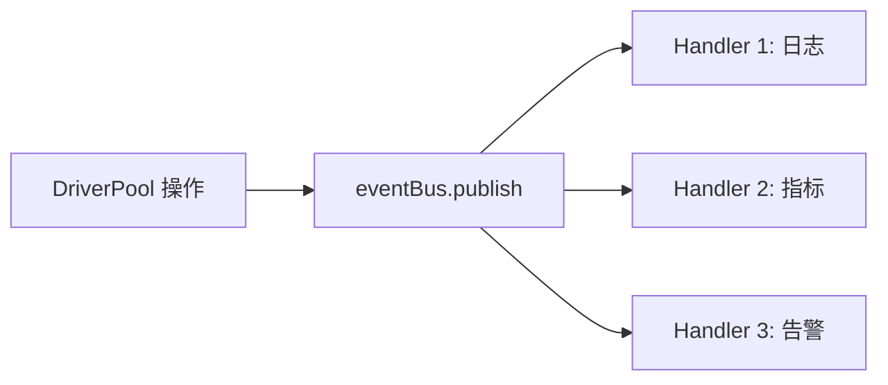

# Pool 事件

📡 `pkg/runner/pool_events.go` — 池运行时事件总线。

`eventBus` 在 `DriverPool` 内部发布事件（借/还/新建/关闭/超时），外部可注册 `PoolEventHandler` 做监控、指标、日志。

> 📁 源码：[`pkg/runner/pool_events.go`](https://github.com/cyberspacesec/snir-skills/blob/main/pkg/runner/pool_events.go)

## 核心类型

| 符号 | 源码 | 说明 |
|------|------|------|
| `PoolEventType` | [L12](https://github.com/cyberspacesec/snir-skills/blob/main/pkg/runner/pool_events.go#L12) | 事件类型枚举 |
| `PoolEvent` | [L30](https://github.com/cyberspacesec/snir-skills/blob/main/pkg/runner/pool_events.go#L30) | 事件结构 |
| `PoolEventHandler` | [L41](https://github.com/cyberspacesec/snir-skills/blob/main/pkg/runner/pool_events.go#L41) | 处理回调 |
| `eventBus` | [L45](https://github.com/cyberspacesec/snir-skills/blob/main/pkg/runner/pool_events.go#L45) | 事件总线 |
| `newEventBus()` | [L51](https://github.com/cyberspacesec/snir-skills/blob/main/pkg/runner/pool_events.go#L51) | 构造 |

## 事件类型

`PoolEventType` 取值（示意）：

| 事件 | 触发时机 |
|------|---------|
| `Acquire` | 借出 Driver |
| `Release` | 归还 Driver |
| `Create` | 新建 Driver |
| `Close` | 关闭 Driver |
| `Timeout` | 空闲超时关闭 |
| `Wait` | 任务排队等待 |

## 发布订阅

## PoolEvent 字段

| 字段 | 说明 |
|------|------|
| `Type` | 事件类型 |
| `Time` | 发生时间 |
| `DriverID` | 涉及的 Driver |
| `Target` | 关联目标（如有） |
| `Stats` | 当时 PoolStats 快照 |

## 应用

- 接 Prometheus/Grafana 做池负载监控
- 慢任务追踪（Acquire→Release 间隔）
- 异常 Driver 发现（频繁 Create/Close）

见 [监控](../guide/monitoring)。

## 下一步

- [DriverPool](./runner-pool)
- [监控](../guide/monitoring)
- [并发与池](../advanced/concurrency)
