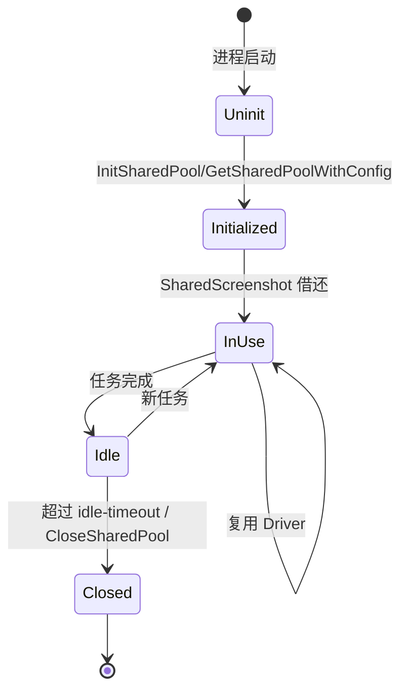
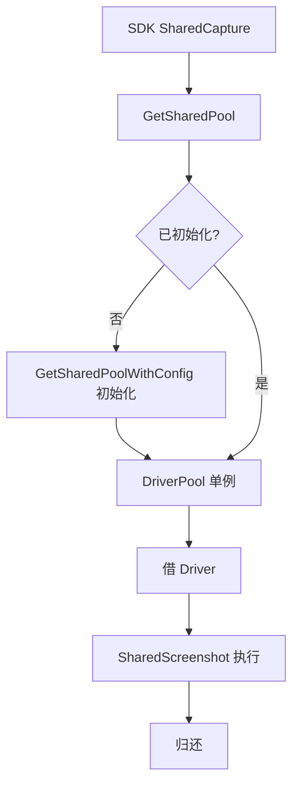

# 共享池单例

♻️ `pkg/runner/pool_singleton.go` — 进程内全局共享池。

共享池单例让进程内多个任务复用同一批 Chrome，SDK 的 `Shared*` 函数底层用它。

> 📁 源码：[`pkg/runner/pool_singleton.go`](https://github.com/cyberspacesec/snir-skills/blob/main/pkg/runner/pool_singleton.go)

## 函数

| 函数 | 源码 | 说明 |
|------|------|------|
| `InitSharedPool(opts, maxConcurrent)` | [L24](https://github.com/cyberspacesec/snir-skills/blob/main/pkg/runner/pool_singleton.go#L24) | 显式初始化 |
| `GetSharedPool()` | [L45](https://github.com/cyberspacesec/snir-skills/blob/main/pkg/runner/pool_singleton.go#L45) | 取共享池 |
| `GetSharedPoolWithConfig(opts, maxConcurrent)` | [L89](https://github.com/cyberspacesec/snir-skills/blob/main/pkg/runner/pool_singleton.go#L89) | 带配置取/初始化 |
| `CloseSharedPool()` | [L110](https://github.com/cyberspacesec/snir-skills/blob/main/pkg/runner/pool_singleton.go#L110) | 关闭释放 |
| `SharedPoolStats()` | [L122](https://github.com/cyberspacesec/snir-skills/blob/main/pkg/runner/pool_singleton.go#L122) | 查看统计 |
| `SharedScreenshot(target, opts)` | [L132](https://github.com/cyberspacesec/snir-skills/blob/main/pkg/runner/pool_singleton.go#L132) | 共享池截图 |
| `SharedScreenshotWithContext(ctx, target, opts)` | [L137](https://github.com/cyberspacesec/snir-skills/blob/main/pkg/runner/pool_singleton.go#L137) | 带 context |
| `SharedSetIdleTimeout(timeout)` | [L146](https://github.com/cyberspacesec/snir-skills/blob/main/pkg/runner/pool_singleton.go#L146) | 设空闲超时 |

## 单例生命周期

## 调用流

## 线程安全

单例用 `sync` 机制保证并发安全，多 goroutine 可同时调用 `Shared*`。`CloseSharedPool` 后再调用 `Shared*` 会重新初始化或返回错误。

## 空闲超时

::: tip 设个 idle 超时，省 Chrome 内存
[`SharedSetIdleTimeout`](https://github.com/cyberspacesec/snir-skills/blob/main/pkg/runner/pool_singleton.go#L146)：浏览器空闲多久后自动关闭释放资源。`0` 表示不自动关闭。

间歇性采集场景（如每小时跑一批）建议设 `5m`~`10m`——空闲时关 Chrome 省内存，下次任务来了自动重启。持续高频采集则设 `0` 保持常驻避免反复启动开销。
:::

## 与 SDK 的关系

SDK `SharedCapture`/`SharedScreenshot` 等调用这些函数。见 [共享池](../sdk/shared)。

## 下一步

- [DriverPool](./runner-pool)
- [SDK 共享池](../sdk/shared)
- [并发与池](../advanced/concurrency)
