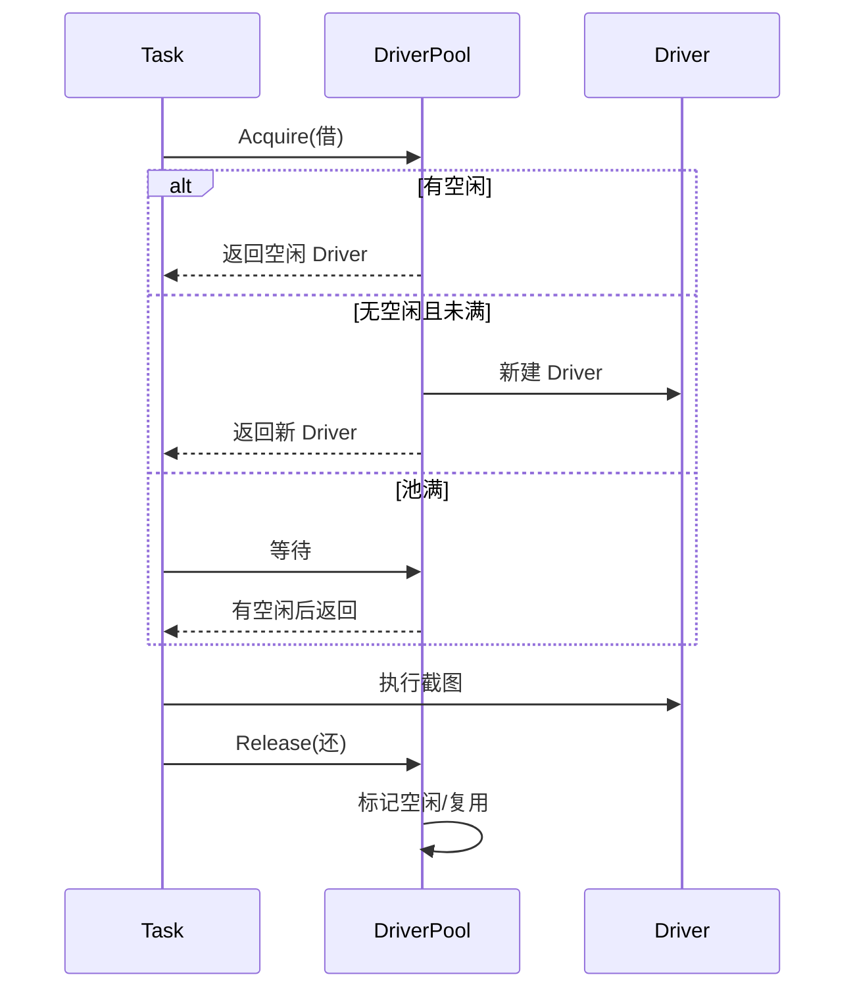
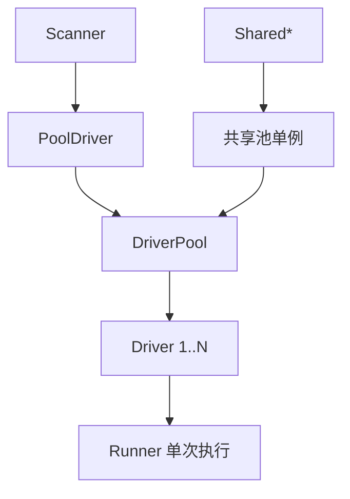

# DriverPool

<p align="center">🏊 `pkg/runner/pool.go` — 进程内浏览器池。</p>

`DriverPool` 管理一批 `Driver`，让并发任务复用浏览器实例，避免反复启动 Chrome。

> 📁 源码：[`pkg/runner/pool.go`](https://github.com/cyberspacesec/snir-skills/blob/main/pkg/runner/pool.go)

## 核心类型

| 类型 | 源码 | 说明 |
|------|------|------|
| `PoolStats` | [L18](https://github.com/cyberspacesec/snir-skills/blob/main/pkg/runner/pool.go#L18) | 池统计（活跃/空闲/等待/累计） |
| `DriverPool` | [L43](https://github.com/cyberspacesec/snir-skills/blob/main/pkg/runner/pool.go#L43) | 池主体 |
| `NewDriverPool` | [L87](https://github.com/cyberspacesec/snir-skills/blob/main/pkg/runner/pool.go#L87) | 构造池 |

```go
func NewDriverPool(opts *Options, maxConcurrent int) (*DriverPool, error)
```

## 借还模型



## 状态流转

```
  Driver 在池中的状态：

  [Idle 空闲] ──Acquire──► [Busy 借出] ──Release──► [Idle]
       │                                              │
       │ 超过 idle-timeout                              │
       ▼                                              │
  [Closed 关闭]                                    复用
```

## PoolStats 字段

| 字段 | 说明 |
|------|------|
| `Active` | 当前借出执行中 |
| `Idle` | 空闲可复用 |
| `Waiting` | 排队等待借取 |
| `Total` | 累计创建数 |

用于监控池负载，`SharedPoolStats()`/`GET /stats` 返回。

## 何时用

- 批量并发截图（`scan file --threads N`）
- 进程内多任务复用

跨进程复用见 [provider](../cli/provider)。共享单例见 [共享池单例](./runner-pool-singleton)。

## 与 PoolDriver/Runner 的层次



## 下一步

- [PoolDriver](./runner-pool-driver)
- [共享池单例](./runner-pool-singleton)
- [Pool 事件](./runner-pool-events)
- [并发与池](../advanced/concurrency)
