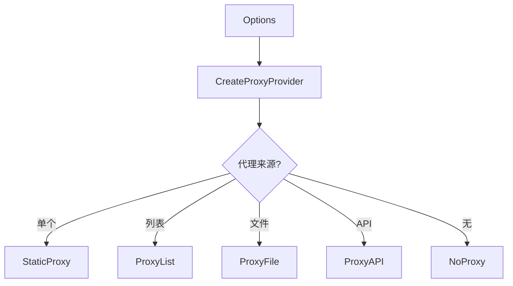
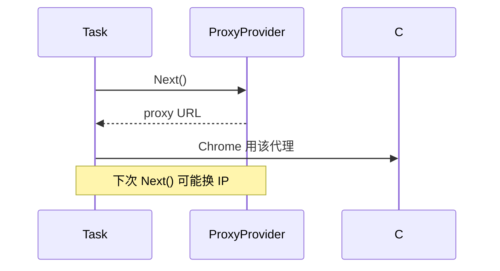

# Proxy

🔀 `pkg/runner/proxy.go` — 代理提供者抽象。

`ProxyProvider` 接口统一多种代理来源（静态、列表、文件、API），支持轮换策略，让批量采集可换 IP。

> 📁 源码：[`pkg/runner/proxy.go`](https://github.com/cyberspacesec/snir-skills/blob/main/pkg/runner/proxy.go)

## 类型

| 符号 | 源码 | 说明 |
|------|------|------|
| `ProxyProvider` | [L19](https://github.com/cyberspacesec/snir-skills/blob/main/pkg/runner/proxy.go#L19) | 接口 |
| `StaticProxy` | [L29](https://github.com/cyberspacesec/snir-skills/blob/main/pkg/runner/proxy.go#L29) | 单个固定代理 |
| `NewStaticProxy(proxy)` | [L34](https://github.com/cyberspacesec/snir-skills/blob/main/pkg/runner/proxy.go#L34) | 构造 |
| `ProxyList` | [L48](https://github.com/cyberspacesec/snir-skills/blob/main/pkg/runner/proxy.go#L48) | 内存列表 |
| `ProxyStrategy` | [L57](https://github.com/cyberspacesec/snir-skills/blob/main/pkg/runner/proxy.go#L57) | 轮换策略 |
| `NewProxyList(proxies, strategy)` | [L69](https://github.com/cyberspacesec/snir-skills/blob/main/pkg/runner/proxy.go#L69) | 构造 |
| `ProxyFile` | [L112](https://github.com/cyberspacesec/snir-skills/blob/main/pkg/runner/proxy.go#L112) | 文件加载 |
| `NewProxyFile(path, strategy)` | [L123](https://github.com/cyberspacesec/snir-skills/blob/main/pkg/runner/proxy.go#L123) | 构造 |
| `NoProxy` | [L221](https://github.com/cyberspacesec/snir-skills/blob/main/pkg/runner/proxy.go#L221) | 不用代理 |
| `CreateProxyProvider(opts)` | [L237](https://github.com/cyberspacesec/snir-skills/blob/main/pkg/runner/proxy.go#L237) | 工厂 |
| `ProxyAPI` | [L273](https://github.com/cyberspacesec/snir-skills/blob/main/pkg/runner/proxy.go#L273) | 动态 API |
| `NewProxyAPI(url, strategy)` | [L284](https://github.com/cyberspacesec/snir-skills/blob/main/pkg/runner/proxy.go#L284) | 构造 |

## ProxyStrategy

| 策略 | 行为 |
|------|------|
| `RoundRobin` | 轮询依次用 |
| `Random` | 随机选 |
| `Sticky` | 同目标固定一个 |

## 工厂

[`CreateProxyProvider`](https://github.com/cyberspacesec/snir-skills/blob/main/pkg/runner/proxy.go#L237) 按 `Options` 字段选实现：

## 轮换流程

## 应用场景

- 绕过目标 IP 限流
- 多地域采集
- 隐匿来源（配合 WebRTC 禁用）

::: tip 配合 WebRTC 禁用才是真匿名
代理只换 HTTP/HTTPS 出口，WebRTC 会绕过代理直连暴露真实 IP。隐匿来源场景务必 `WithDisableWebRTC()`，否则代理白用——目标站通过 WebRTC 一探就露馅。
:::

见 [代理（进阶）](../advanced/proxy) 与 [CLI scan proxy](../cli/scan-proxy)。

## 下一步

- [代理（进阶）](../advanced/proxy)
- [CLI scan proxy](../cli/scan-proxy)
- [安全](../advanced/security)
- [Options](./runner-options)
