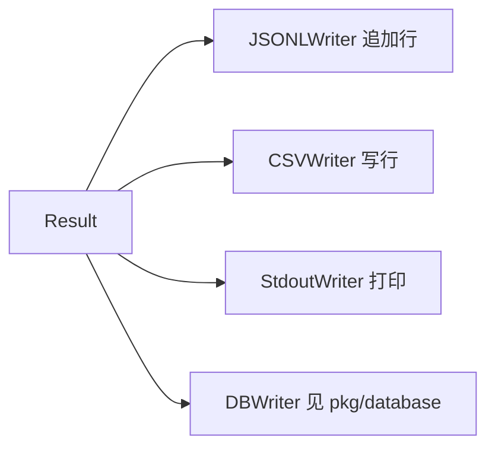

# Writer

<p align="center">📤 `pkg/runner/writer.go` — 多格式持久化。</p>

`Writer` 接口抽象 `Result` 的持久化，多种实现可同时启用。

> 📁 源码：[`pkg/runner/writer.go`](https://github.com/cyberspacesec/snir-skills/blob/main/pkg/runner/writer.go)

## 类型与构造

| 符号 | 源码 | 说明 |
|------|------|------|
| `JSONLWriter` | [L18](https://github.com/cyberspacesec/snir-skills/blob/main/pkg/runner/writer.go#L18) | 流式 JSONL |
| `NewJSONLWriter(filePath)` | [L23](https://github.com/cyberspacesec/snir-skills/blob/main/pkg/runner/writer.go#L23) | 构造 |
| `CSVWriter` | [L71](https://github.com/cyberspacesec/snir-skills/blob/main/pkg/runner/writer.go#L71) | 表格 CSV |
| `NewCSVWriter(filePath)` | [L78](https://github.com/cyberspacesec/snir-skills/blob/main/pkg/runner/writer.go#L78) | 构造 |
| `StdoutWriter` | [L150](https://github.com/cyberspacesec/snir-skills/blob/main/pkg/runner/writer.go#L150) | 控制台 |
| `NewStdoutWriter()` | [L153](https://github.com/cyberspacesec/snir-skills/blob/main/pkg/runner/writer.go#L153) | 构造 |
| `CreateWriters(opts)` | [L181](https://github.com/cyberspacesec/snir-skills/blob/main/pkg/runner/writer.go#L181) | 按 Options 创建一组 |

## CreateWriters 工厂

[`CreateWriters`](https://github.com/cyberspacesec/snir-skills/blob/main/pkg/runner/writer.go#L181) 依据 `Options.Writer`（Jsonl/Csv/Stdout）创建启用的 Writer 列表：

```mermaid
flowchart TD
  O[Options.Writer] --> CW[CreateWriters]
  CW --> J{Jsonl?}
  J -- 是 --> JW[NewJSONLWriter]
  J --> C{Csv?}
  C -- 是 --> CW2[NewCSVWriter]
  C --> S{Stdout?}
  S -- 是 --> SW[NewStdoutWriter]
  JW --> OUT[[]Writer]
  CW2 --> OUT
  SW --> OUT
```

## 分发

`Runner` 把每个 `Result` 分发给所有 `Writer`：



## 各格式特点

| 格式 | 特点 | 嵌套字段处理 |
|------|------|-------------|
| JSONL | 每行一条完整 JSON，流式追加 | 完整保留（序列化为 JSON 对象/数组） |
| CSV | 扁平表格，每行一条 | 序列化为字符串或省略 |
| Stdout | 实时控制台，彩色 | 摘要打印 |

## JSONLWriter 实现

`JSONLWriter` 持有文件句柄，每条 `Result` `json.Marshal` 后追加一行（`\n` 分隔）。适合流式管线与 `jq` 处理。

```
results.jsonl:
{"schema_version":"snir-skills.result.v1","url":"a.com",...}\n
{"schema_version":"snir-skills.result.v1","url":"b.com",...}\n
{"schema_version":"snir-skills.result.v1","url":"c.com",...}\n
```

详见 [输出选项](../cli/scan-output)。

## 下一步

- [Runner 核心](./runner-core)
- [输出选项](../cli/scan-output)
- [输出格式（进阶）](../advanced/output-formats)
- [pkg/database](./database)
