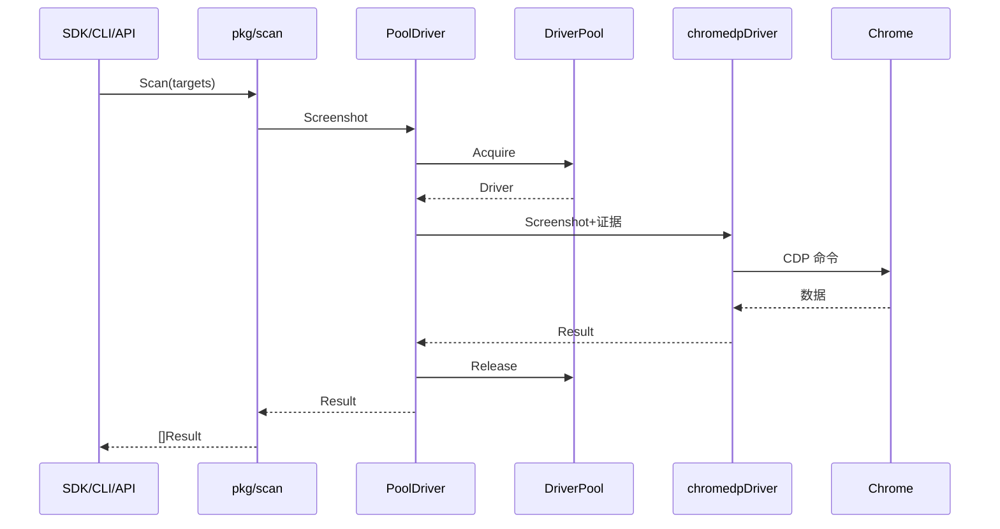

# pkg/runner

🏃 `pkg/runner/` — 浏览器执行核心。

`pkg/runner` 是 snir 的心脏：驱动 Chrome、采集证据、管理连接池、处理代理/Cookie/黑名单/设备模拟。本页是该目录的总入口，子模块各有详解。

> 📁 源码目录：[`pkg/runner/`](https://github.com/cyberspacesec/snir-skills/blob/main/pkg/runner)

## 子模块地图

```mermaid
graph TD
  R[pkg/runner]
  R --> CORE[runner.go 核心]
  R --> DRV[driver.go 接口]
  R --> CDP[driver_chromedp.go CDP实现]
  R --> OPT[options.go 选项]
  R --> WRT[writer.go 持久化]
  R --> POOL[pool.go 池]
  R --> PD[pool_driver.go 池执行]
  R --> SING[pool_singleton.go 共享池]
  R --> EVT[pool_events.go 事件]
  R --> BL[blacklist.go SSRF防护]
  R --> PRX[proxy.go 代理]
  R --> CKJ[cookie_jar.go CookieJar]
  R --> CKN[cookie_netscape.go]
  R --> CKU[cookie_util.go]
  R --> DEV[device_presets.go 设备]
  R --> DISC[discovery.go 发现]
```

## 子模块速查

| 子模块 | 源码 | 职责 | 详解 |
|--------|------|------|------|
| 核心 | [runner.go](https://github.com/cyberspacesec/snir-skills/blob/main/pkg/runner/runner.go) | `Runner` 单次执行 | [→](./runner-core) |
| Driver 接口 | [driver.go](https://github.com/cyberspacesec/snir-skills/blob/main/pkg/runner/driver.go) | `Driver` 抽象 | [→](./runner-driver) |
| Chromedp | [driver_chromedp.go](https://github.com/cyberspacesec/snir-skills/blob/main/pkg/runner/driver_chromedp.go) | CDP 实现 | [→](./runner-chromedp) |
| Options | [options.go](https://github.com/cyberspacesec/snir-skills/blob/main/pkg/runner/options.go) | 配置容器 | [→](./runner-options) |
| Writer | [writer.go](https://github.com/cyberspacesec/snir-skills/blob/main/pkg/runner/writer.go) | 多格式输出 | [→](./runner-writer) |
| Pool | [pool.go](https://github.com/cyberspacesec/snir-skills/blob/main/pkg/runner/pool.go) | 浏览器池 | [→](./runner-pool) |
| PoolDriver | [pool_driver.go](https://github.com/cyberspacesec/snir-skills/blob/main/pkg/runner/pool_driver.go) | 池化执行 | [→](./runner-pool-driver) |
| 共享池 | [pool_singleton.go](https://github.com/cyberspacesec/snir-skills/blob/main/pkg/runner/pool_singleton.go) | 进程单例 | [→](./runner-pool-singleton) |
| 事件 | [pool_events.go](https://github.com/cyberspacesec/snir-skills/blob/main/pkg/runner/pool_events.go) | 事件总线 | [→](./runner-pool-events) |
| 黑名单 | [blacklist.go](https://github.com/cyberspacesec/snir-skills/blob/main/pkg/runner/blacklist.go) | SSRF 防护 | [→](./runner-blacklist) |
| 代理 | [proxy.go](https://github.com/cyberspacesec/snir-skills/blob/main/pkg/runner/proxy.go) | 代理提供者 | [→](./runner-proxy) |
| CookieJar | [cookie_jar.go](https://github.com/cyberspacesec/snir-skills/blob/main/pkg/runner/cookie_jar.go) | Cookie 容器 | [→](./runner-cookie-jar) |
| Netscape | [cookie_netscape.go](https://github.com/cyberspacesec/snir-skills/blob/main/pkg/runner/cookie_netscape.go) | cookies.txt | [→](./runner-cookie-netscape) |
| Cookie 工具 | [cookie_util.go](https://github.com/cyberspacesec/snir-skills/blob/main/pkg/runner/cookie_util.go) | 解析转换 | [→](./runner-cookie-util) |
| 设备预设 | [device_presets.go](https://github.com/cyberspacesec/snir-skills/blob/main/pkg/runner/device_presets.go) | 移动设备 | [→](./runner-device) |
| 发现 | [discovery.go](https://github.com/cyberspacesec/snir-skills/blob/main/pkg/runner/discovery.go) | 自动发现 Chrome | [→](./runner-discovery) |

## 调用关系

## 设计要点

- **依赖反转**：`Runner` 依赖 `Driver` 接口，chromedp 是其实现，可替换
- **池化复用**：`DriverPool` 避免反复启动 Chrome
- **安全默认**：`Options` 默认开黑名单、合理超时
- **多 Writer 分发**：一次采集多种输出

## 下一步

- [Runner 核心](./runner-core)
- [Driver 接口](./runner-driver)
- [内部模块总览](./overview)
- [架构](../guide/architecture)
