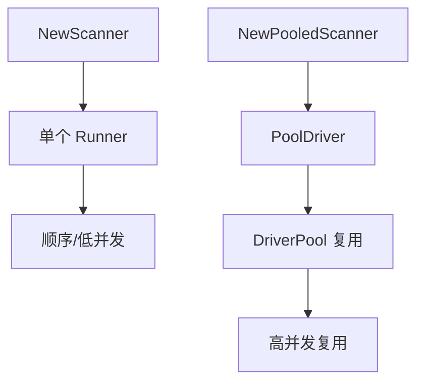

# Scan

<p align="center">🎯 `pkg/scan/scan.go` — 批量扫描编排。</p>

`pkg/scan` 在 `Runner` 之上做批量编排：目标展开、并发调度、池复用、重试、结果聚合。

> 📁 源码：[`pkg/scan/scan.go`](https://github.com/cyberspacesec/snir-skills/blob/main/pkg/scan/scan.go)

## 核心类型

| 符号 | 源码 | 说明 |
|------|------|------|
| `Config` | [L18](https://github.com/cyberspacesec/snir-skills/blob/main/pkg/scan/scan.go#L18) | 扫描配置（线程/重试/池） |
| `Scanner` | [L28](https://github.com/cyberspacesec/snir-skills/blob/main/pkg/scan/scan.go#L28) | 单浏览器扫描器 |
| `NewScanner(opts)` | [L43](https://github.com/cyberspacesec/snir-skills/blob/main/pkg/scan/scan.go#L43) | 构造单实例扫描器 |
| `NewPooledScanner(opts, cfg)` | [L107](https://github.com/cyberspacesec/snir-skills/blob/main/pkg/scan/scan.go#L107) | 构造池化扫描器 |
| `ExpandTargets(input)` | [L196](https://github.com/cyberspacesec/snir-skills/blob/main/pkg/scan/scan.go#L196) | 展开目标（含 CIDR/文件） |
| `(*Scanner) Scan(targets)` | [L230](https://github.com/cyberspacesec/snir-skills/blob/main/pkg/scan/scan.go#L230) | 执行扫描 |

## Config 字段

| 字段 | 说明 |
|------|------|
| `Threads` | 并发数 |
| `MaxRetries` | 单目标最大重试 |
| `UsePool` | 是否用 DriverPool |
| `PoolSize` | 池大小 |
| `ContinueOnError` | 出错继续 |
| `OutputPath` | 结果输出路径 |

## Scan 流程

```mermaid
flowchart TD
  IN[输入目标] --> EX[ExpandTargets 展开]
  EX --> TG[[]string 目标列表]
  TG --> SCH[并发调度]
  SCH --> LOOP{每个目标}
  LOOP --> RT[重试循环]
  RT --> R[Runner/PoolDriver 截图]
  R --> OK{成功?}
  OK -- 是 --> WR[写 Writer]
  OK -- 否 重试未满 --> RT
  OK -- 否 重试已满 --> ERR[记录失败]
  WR --> NXT[下一目标]
  ERR --> NXT
  NXT --> DONE[全部完成]
```

## ExpandTargets

[`ExpandTargets`](https://github.com/cyberspacesec/snir-skills/blob/main/pkg/scan/scan.go#L196) 把多种输入归一为目标列表：

```mermaid
flowchart LR
  A[输入] --> T{类型?}
  T -- 单 URL/IP --> L[直接加入]
  T -- CIDR --> C[展开为 IP 列表]
  T -- 文件路径 --> F[逐行读取]
  L --> OUT[[]string]
  C --> OUT
  F --> OUT
```

支持 CIDR 见 [`scan cidr`](../cli/scan-cidr)，文件见 [`scan file`](../cli/scan-file)。

## 单实例 vs 池化



::: tip 选型：少量用 NewScanner，批量用 NewPooledScanner
- `NewScanner`：每次新建 Runner，适合**少量目标或简单场景**——省去建池开销
- `NewPooledScanner`：复用 Chrome 池，适合**批量**——避免反复启动浏览器的巨大开销

> 10 个以内目标用 `NewScanner` 即可；上百上千必上 `NewPooledScanner`，否则每个目标都启停一次 Chrome 会慢到无法接受。
:::

## 与 CLI/API 的关系

CLI `scan *` 与 API `/screenshot`、`/batch` 最终都构造 `Scanner`/`PooledScanner` 执行：

```mermaid
flowchart LR
  CLI[CLI scan] --> S[Scanner]
  API[API /batch] --> S
  SDK[SDK BatchCapture] --> S
  S --> RES[[]Result]
```

## 下一步

- [Runner 核心](./runner-core)
- [DriverPool](./runner-pool)
- [CLI scan](../cli/scan)
- [并发与池](../advanced/concurrency)
