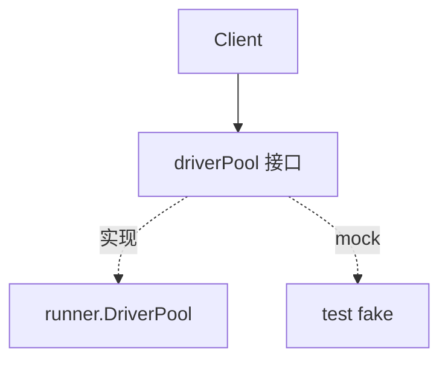
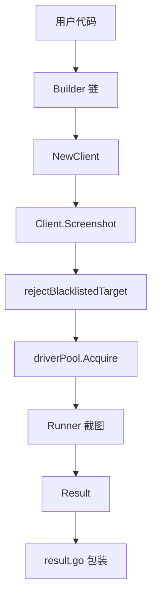

# pkg/sdk（内部视角）

🧩 `pkg/sdk/` — Go SDK 实现细节。

`pkg/sdk` 把 `runner`/`scan` 的能力包装成稳定、链式、易用的 Go API。本文从源码角度剖析其内部结构。

> 📁 源码目录：[`pkg/sdk/`](https://github.com/cyberspacesec/snir-skills/blob/main/pkg/sdk)

## 文件职责

| 文件 | 源码 | 职责 |
|------|------|------|
| `client.go` | [client.go](https://github.com/cyberspacesec/snir-skills/blob/main/pkg/sdk/client.go) | `Client` 主体、Screenshot/Batch |
| `options.go` | [options.go](https://github.com/cyberspacesec/snir-skills/blob/main/pkg/sdk/options.go) | `ClientOptions`、Builder |
| `builders.go` | [builders.go](https://github.com/cyberspacesec/snir-skills/blob/main/pkg/sdk/builders.go) | 链式 Builder 函数 |
| `result.go` | [result.go](https://github.com/cyberspacesec/snir-skills/blob/main/pkg/sdk/result.go) | 结果包装与字节提取 |
| `shared.go` | [shared.go](https://github.com/cyberspacesec/snir-skills/blob/main/pkg/sdk/shared.go) | 共享池便捷函数 |
| `targets.go` | [targets.go](https://github.com/cyberspacesec/snir-skills/blob/main/pkg/sdk/targets.go) | 目标展开 |
| `autoconnect.go` | [autoconnect.go](https://github.com/cyberspacesec/snir-skills/blob/main/pkg/sdk/autoconnect.go) | 自动发现 Chrome |

## Client 核心

| 符号 | 源码 | 说明 |
|------|------|------|
| `Client` | [L54](https://github.com/cyberspacesec/snir-skills/blob/main/pkg/sdk/client.go#L54) | SDK 主入口 |
| `driverPool`（内部接口） | [L60](https://github.com/cyberspacesec/snir-skills/blob/main/pkg/sdk/client.go#L60) | 池抽象（便于测试 mock） |
| `NewClient(opts)` | [L78](https://github.com/cyberspacesec/snir-skills/blob/main/pkg/sdk/client.go#L78) | 构造 |
| `NewRemoteClient(wsURL, max)` | [L113](https://github.com/cyberspacesec/snir-skills/blob/main/pkg/sdk/client.go#L113) | 远程 Chrome 构造 |
| `BatchResult` | [L1656](https://github.com/cyberspacesec/snir-skills/blob/main/pkg/sdk/client.go#L1656) | 批量结果 |
| `ScreenshotRequest` | [L1683](https://github.com/cyberspacesec/snir-skills/blob/main/pkg/sdk/client.go#L1683) | 请求体 |

## 依赖反转

`Client` 不直接依赖 `*runner.DriverPool`，而是依赖内部接口 `driverPool`（[L60](https://github.com/cyberspacesec/snir-skills/blob/main/pkg/sdk/client.go#L60)），便于单测注入 mock：

## 黑名单前置

SDK 在截图前先校验目标：

| 函数 | 源码 | 说明 |
|------|------|------|
| `rejectBlacklistedTarget` | [L1726](https://github.com/cyberspacesec/snir-skills/blob/main/pkg/sdk/client.go#L1726) | 拦截并返回错误结果 |
| `blacklistedResult` | [L1737](https://github.com/cyberspacesec/snir-skills/blob/main/pkg/sdk/client.go#L1737) | 构造黑名单 Result |
| `appendCookieSources` | [L1796](https://github.com/cyberspacesec/snir-skills/blob/main/pkg/sdk/client.go#L1796) | 标注 Cookie 来源 |
| `extractDomain` | [L1861](https://github.com/cyberspacesec/snir-skills/blob/main/pkg/sdk/client.go#L1861) | 提取域名 |

## 调用链

## 下一步

- [SDK 概览（用户视角）](../sdk/overview)
- [Client](../sdk/client)
- [构建器](../sdk/builders)
- [共享池](../sdk/shared)
- [pkg/runner](./runner)
