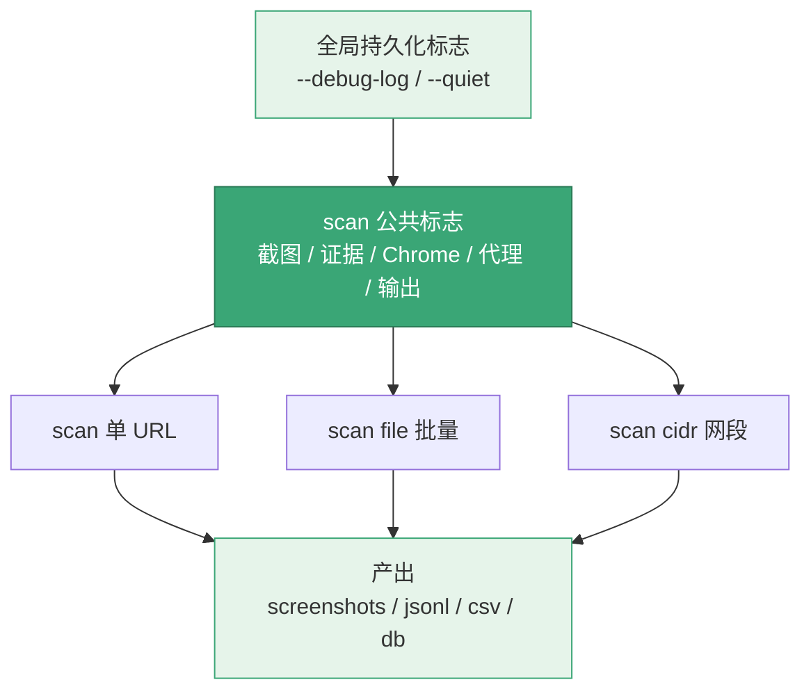
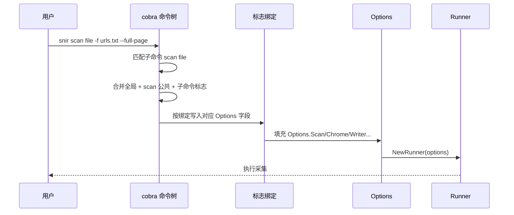

# CLI 标志全表

🧾 snir 命令行标志完整参考。

标志按子命令分层继承，全局标志与 scan 公共标志被所有 `scan` 子命令复用：

标志从命令行到运行时的解析时序：

## 全局持久化标志

| 标志 | 简写 | 默认 | 说明 |
|------|------|------|------|
| `--debug-log` | `-D` | false | 启用调试日志 |
| `--quiet` | `-q` | false | 静默（几乎所有）日志 |

## scan 公共标志（所有 scan 子命令继承）

### 截图

| 标志 | 默认 | 说明 |
|------|------|------|
| `--screenshot-path` | `screenshots` | 截图保存路径 |
| `--screenshot-format` | `png` | 格式（png/jpeg） |
| `--screenshot-quality` | 90 | 质量（仅 jpeg） |
| `--skip-screenshot` | false | 跳过保存截图 |
| `--full-page` | false | 截完整页面 |
| `--selector` | — | CSS 选择器截图 |
| `--xpath` | — | XPath 截图 |
| `--resolution-x` | 1280 | 窗口宽度 |
| `--resolution-y` | 800 | 窗口高度 |

### 证据

| 标志 | 说明 |
|------|------|
| `--save-html` | 保存 HTML |
| `--save-headers` | 保存 HTTP 头 |
| `--save-cookies` | 保存 Cookie |
| `--save-console` | 保存控制台日志 |
| `--save-network` | 保存网络请求 |

### Chrome

| 标志 | 默认 | 说明 |
|------|------|------|
| `--chrome-path` | — | Chrome 路径 |
| `--user-agent` | — | 自定义 UA |
| `--timeout` | 30 | 页面加载超时（秒） |
| `--delay` | 0 | 截图前等待（秒） |
| `--headless` | true | 无头模式 |
| `--ignore-cert-errors` | false | 忽略证书错误 |
| `--wss` | — | 远程 Chrome WebSocket URL |

### 代理

| 标志 | 说明 |
|------|------|
| `--proxy` | 单代理 |
| `--proxy-list` | 代理列表（可多次） |
| `--proxy-file` | 代理文件（热加载） |
| `--proxy-url` | 动态代理 API |
| `--proxy-strategy` | round-robin/random/sequential |

### Cookie

| 标志 | 说明 |
|------|------|
| `--cookie-file` | Cookie 持久化文件（JSON） |
| `--cookie-write-back` | 截图后写回 |
| `--cookie-export` | 导出 Netscape |
| `--cookie-import` | 导入 Netscape |
| `--cookie` | 内联 Cookie（可多次） |

### 设备与 JS

| 标志 | 说明 |
|------|------|
| `--device` | 设备预设名 |
| `--list-devices` | 列出预设 |
| `--js` | 注入 JS |
| `--js-file` | JS 文件 |
| `--run-js-before` | 加载前执行 |

### 扫描

| 标志 | 默认 | 说明 |
|------|------|------|
| `--threads` | 2 | 并发线程 |
| `--http` | true | 用 HTTP |
| `--https` | true | 用 HTTPS |
| `--ports` | — | 端口列表 |
| `--max-retries` | 1 | 最大重试 |

### 输出与库

| 标志 | 默认 | 说明 |
|------|------|------|
| `--write-jsonl` | false | 写 JSONL |
| `--jsonl-file` | `results.jsonl` | JSONL 文件 |
| `--write-csv` | false | 写 CSV |
| `--csv-file` | `results.csv` | CSV 文件 |
| `--write-stdout` | true | 控制台输出 |
| `--db` | false | 启用 SQLite |
| `--db-path` | `go-web-screenshot.db` | DB 文件 |

### 黑名单

| 标志 | 默认 | 说明 |
|------|------|------|
| `--enable-blacklist` | true | 启用黑名单 |
| `--default-blacklist` | true | 用默认规则 |
| `--blacklist-pattern` | — | 自定义规则（可多次） |
| `--blacklist-file` | — | 规则文件 |

## scan file 专属

| 标志 | 简写 | 说明 |
|------|------|------|
| `--file` | `-f` | URL 列表文件 |

## api 命令

| 标志 | 说明 |
|------|------|
| `--host` | 监听地址 |
| `--port` | 监听端口 |
| `--api-key` | API 密钥 |
| `--max-concurrent` | 最大并发 |
| `--queue-size` | 队列大小 |

## 下一步

- [CLI 总览](../cli/overview)
- [各 scan 子命令](../cli/scan)
- [全局选项](../cli/global-options)
