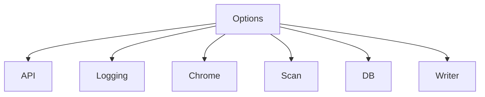

# 配置参考

⚙️ snir 的配置方式与默认值。

snir 以命令行标志为主配置方式，不依赖配置文件。所有配置通过 `pkg/runner.Options` 结构承载。

## 配置维度

`Options` 分为若干功能组：

| 组 | 职责 |
|----|------|
| `API` | HTTP API server（host/port/api_key/max_concurrent/queue_size） |
| `Logging` | 日志（debug/silence） |
| `Chrome` | 浏览器（路径/UA/超时/视口/代理/指纹/设备/WSS） |
| `Scan` | 扫描（线程/截图/证据/JS/黑名单/端口/Cookie/选择器） |
| `DB` | SQLite（enable/path） |
| `Writer` | 输出（jsonl/csv/stdout） |

## 默认值速查

::: info 开箱即用的安全默认
默认值经过精心调校，开箱即安全可用：
- ✅ **黑名单默认启用 + 内置规则**（防 SSRF）
- ✅ **无头模式**（不弹窗，适合自动化）
- ✅ **合理超时 30s**（兼顾速度与慢站点）
- ✅ **HTTP/HTTPS 都启用**（自动探测协议）

无需任何配置 `snir scan example.com` 即可正常工作，按需覆盖个别项即可。
:::

| 项 | 默认 |
|----|------|
| 截图路径 | `screenshots` |
| 截图格式 | `png` |
| JPEG 质量 | `90` |
| 窗口 | `1280×800` |
| 超时 | `30s` |
| 延迟 | `0s` |
| 无头 | `true` |
| 并发线程 | `2` |
| HTTP/HTTPS | 都启用 |
| 最大重试 | `1` |
| 控制台输出 | `true` |
| 黑名单 | 启用 + 默认规则 |
| JSONL 文件 | `results.jsonl` |
| CSV 文件 | `results.csv` |
| DB 文件 | `go-web-screenshot.db` |

## Go SDK 配置

SDK 用 `ClientOptions`（客户端级）+ `ScreenshotOptions`（每截图级，Builder 模式）。见 [ClientOptions](../sdk/client-options) 与 [构建器](../sdk/builders)。

## 环境变量

snir 主要不依赖环境变量；Chrome 路径可通过 `--chrome-path` 显式指定，或让 chromedp 自动发现。

## 远程 Chrome

不使用本地 Chrome 时，配置 `--wss ws://host:9222/devtools/browser/<id>`。见 [远程 Chrome](../advanced/remote-chrome)。

## 下一步

- [CLI 标志全表](./cli-flags)
- [Options 结构](../internals/runner-options)
- [ClientOptions](../sdk/client-options)
