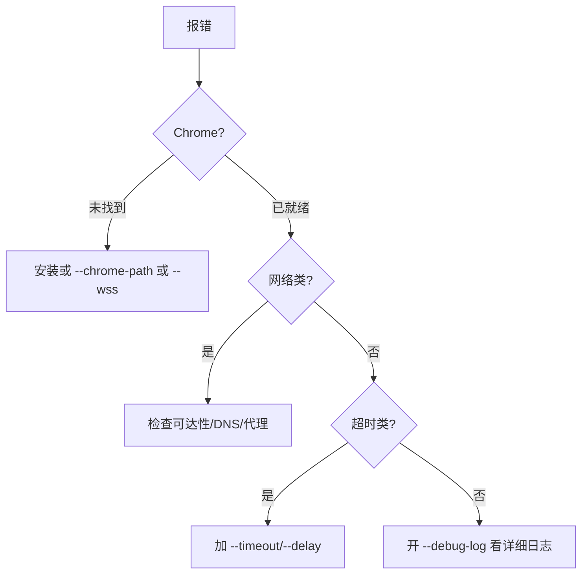

# 错误码与错误信息

<p align="center">⚠️ snir 常见错误及排查指引。</p>

snir 是 CLI 工具，退出码非零表示失败。本页罗列常见错误信息与建议处理。

## 退出码

| 退出码 | 含义 |
|--------|------|
| `0` | 成功 |
| 非 `0` | 执行出错（具体原因见 stderr） |

## 常见错误信息

### Could not find node with given id

```
无法找到页面上的某个元素
```

**原因**：页面元素在截图/选择器定位时不存在。

**建议**：
1. 网站加载较慢 → 增加超时 `--timeout 60`
2. 网站反爬虫
3. 网站结构与预期不符
4. 增加延迟 `--delay 3`

### timeout / 扫描超时

```
扫描超时: 无法在指定时间内完成页面加载
```

**建议**：
1. 增加超时 `--timeout 60`
2. 检查网络连接
3. 检查目标站点是否可访问

### net::ERR_*

```
网络错误: 无法连接到目标网站
```

常见 `net::ERR_CONNECTION_REFUSED`、`ERR_NAME_NOT_RESOLVED`、`ERR_TIMED_OUT`。

**建议**：检查目标可达性、DNS、代理配置。

### Chrome 未找到

```
ChromeNotFoundError
```

**建议**：
1. 安装 Chrome/Chromium
2. 指定路径 `--chrome-path /usr/bin/chromium`
3. 用远程 Chrome `--wss ws://...`

### 证书错误

**建议**：测试环境可 `--ignore-cert-errors`（生产慎用）。

## 排查流程



## 调试日志

加 `-D` 启用调试日志，输出详细 CDP 交互过程：

```bash
snir scan example.com -D
```

## 下一步

- [故障排查](../advanced/troubleshooting)：更完整的排查清单
- [CLI 总览](../cli/overview)
- [性能调优](../advanced/performance)
